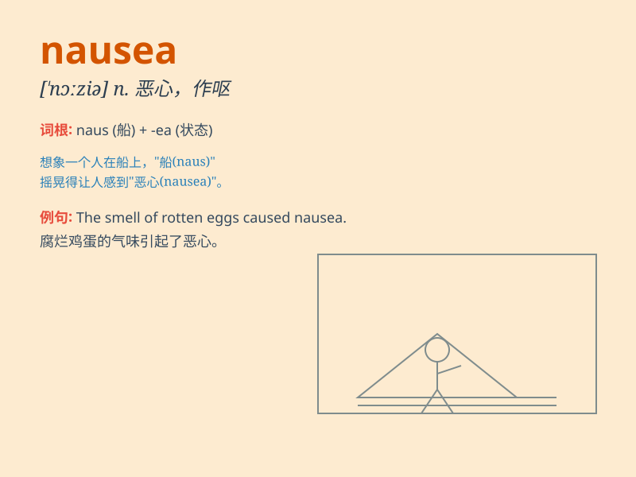

## nausea

**英音:** _[ˈnɔ:ziə]_ **美音:** _[\'nɔzɪə]_

**译义:** *n.反胃,晕船,恶心,作呕,极度的不快*

### 短语

+ **nausea and vomiting:** _恶心和呕吐_

+ **feel nausea:** _感到恶心_

+ **nausea sensation:** _恶心的感觉_

+ **induce nausea:** _引起恶心_

+ **nausea symptoms:** _恶心症状_

### 例句

#### 例句1

> **The smell of the rotten food caused her to feel nausea.**

**中文翻译:** 腐烂食物的气味使她感到恶心。

**单词释义:** 恶心；作呕

#### 例句2

> **He experienced nausea after the long car ride.**

**中文翻译:** 在长途车程之后，他感到恶心。

**单词释义:** 恶心；反胃

#### 例句3

> **The side effect of the medicine is nausea and dizziness.**

**中文翻译:** 这种药的副作用是恶心和头晕。

**单词释义:** 恶心

### 背诵小故事

> One day, I went on a wild boat ride. The constant rocking and the
smell of the sea made me feel very uncomfortable. I had a strong feeling
of nausea and thought I was going to throw up.

**有一天，我去坐了一趟疯狂的船。持续的摇晃和大海的气味让我感觉非常不舒服。我有一种强烈的恶心感，觉得自己快要吐了。**

### 图义

