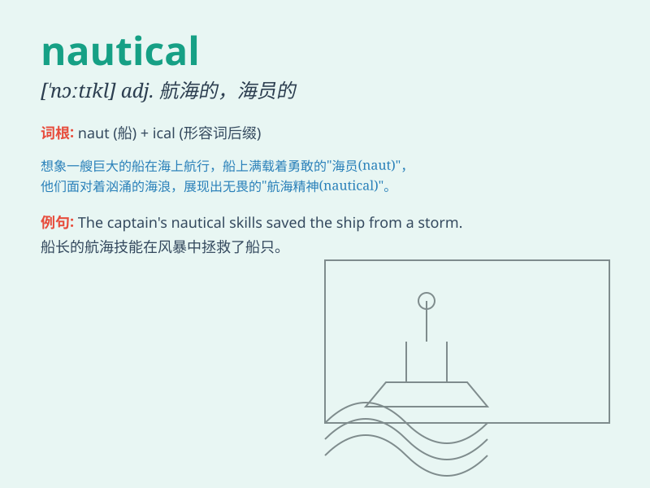

## nautical

**英音:** _[\'nɔːtɪk(ə)l]_ **美音:** _[\'nɔtɪkl]_

**译义:** *adj.船员的,船舶的,海上的,航海的,海军的*

### 短语

+ **nautical mile:** _海里_

+ **nautical chart:** _航海图_

+ **nautical astronomy:** _航海天文学_

+ **nautical almanac:** _航海天文历_

+ **nautical twilight:** _航海晨昏蒙影_

### 例句

#### 例句1

> **He has a passion for nautical adventures.**

**中文翻译:** 他热衷于航海冒险。

**单词释义:** 航海的

#### 例句2

> **The museum has a rich collection of nautical artifacts.**

**中文翻译:** 这个博物馆有丰富的航海文物收藏。

**单词释义:** 航海的

#### 例句3

> **She is an expert in nautical charts.**

**中文翻译:** 她是航海图方面的专家。

**单词释义:** 航海的

### 背诵小故事

> A sailor was lost at sea. He had no idea which direction to go.
Suddenly, he found a nautical chart and was able to navigate safely
back. Nautical means relating to ships, sailors, and navigation.

**一位水手在海上迷路了。他不知道该往哪个方向走。突然，他找到了一张航海图，得以安全返航。nautical
这个词意思是与船舶、水手和航海有关的。**

### 图义

