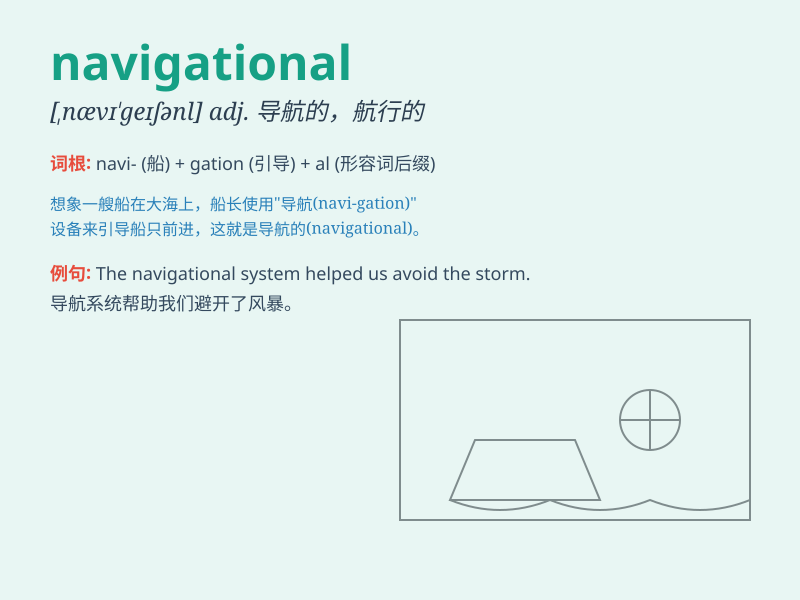

## navigational

**英音:** _[,nævɪ\'geɪʃnəl]_ **美音:**
_[,nævə\'geʃənəl]_

**译义:** *adj.航行的,航海的*

### 短语

+ **navigational aid:** _导航辅助设备_

+ **navigational chart:** _航海图；导航图_

+ **navigational system:** _导航系统_

+ **navigational beacon:** _导航信标_

+ **navigational skills:** _导航技能；航行技能_

### 例句

#### 例句1

> **The navigational system in the new car is very advanced.**

**中文翻译:** 新车里的导航系统非常先进。

**单词释义:** 导航的；航行的

#### 例句2

> **Navigational skills are essential for sailors.**

**中文翻译:** 航行技能对水手来说是必不可少的。

**单词释义:** 导航的；航行的

#### 例句3

> **They encountered difficulties due to faulty navigational
equipment.**

**中文翻译:** 由于导航设备故障，他们遇到了困难。

**单词释义:** 导航的；航行的

### 背诵小故事

> Imagine a brave sailor on a long journey. He uses all kinds of
navigational tools like maps and compasses to find the right way.
\'Navigational\' is like these tools, helping us find the correct path
or direction.

**想象一位勇敢的水手在长途旅行中。他使用各种导航工具，如地图和指南针来找到正确的路。\'navigational\'就像这些工具，帮助我们找到正确的路径或方向。**

### 图义

