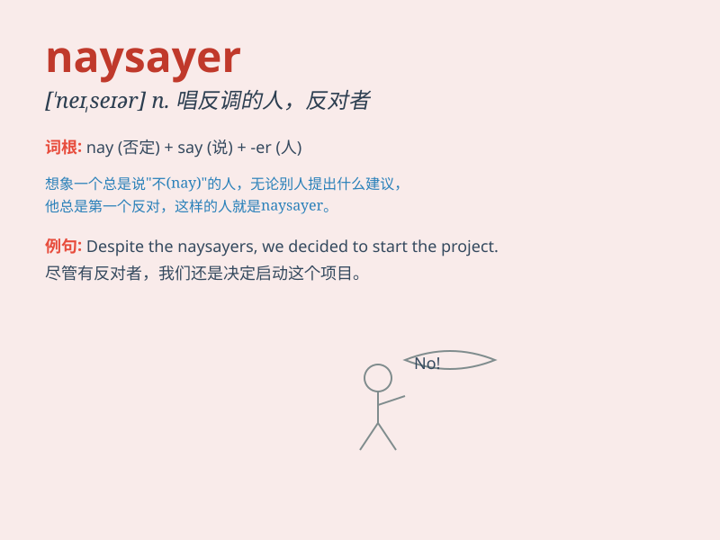

## naysayer

**英音:** _[ˈneɪˌseɪər]_ **美音:** _[ˈneɪˌseɪər]_

**译义:** *n. 唱反调的人，反对者，否定者*

### 短语

+ **professional naysayer:** _专业的反对者_

+ **constant naysayer:** _一贯的反对者_

+ **relentless naysayer:** _无情的反对者_

+ **habitual naysayer:** _习惯唱反调的人_

+ **blatant naysayer:** _公然的反对者_

### 例句

#### 例句1

> **Don\'t listen to the naysayer; believe in your ability to
succeed.**

**中文翻译:** 不要听那些唱反调的人的话；相信你自己成功的能力。

**单词释义:** 总是唱反调的人

#### 例句2

> **The naysayer predicted that the project would fail, but we proved
them wrong.**

**中文翻译:**
那个总是唱反调的人预测这个项目会失败，但我们证明他们错了。

**单词释义:** 持否定态度的人

#### 例句3

> **Despite the naysayers\' doubts, she pursued her dream and
achieved it.**

**中文翻译:**
尽管有那些唱反调的人的怀疑，她还是追求自己的梦想并且实现了。

**单词释义:** 否定者

### 背诵小故事

> Once upon a time, in a village, whenever there was a new idea, a
person always said no. This person was called a naysayer. He refused
every possibility without even trying. Everyone disliked his negative
attitude.

**从前，在一个村子里，每当有新想法时，总有一个人总是说不。这个人被称为老是唱反调的人。他甚至不尝试就拒绝每一种可能性。每个人都不喜欢他的消极态度。**

### 图义

