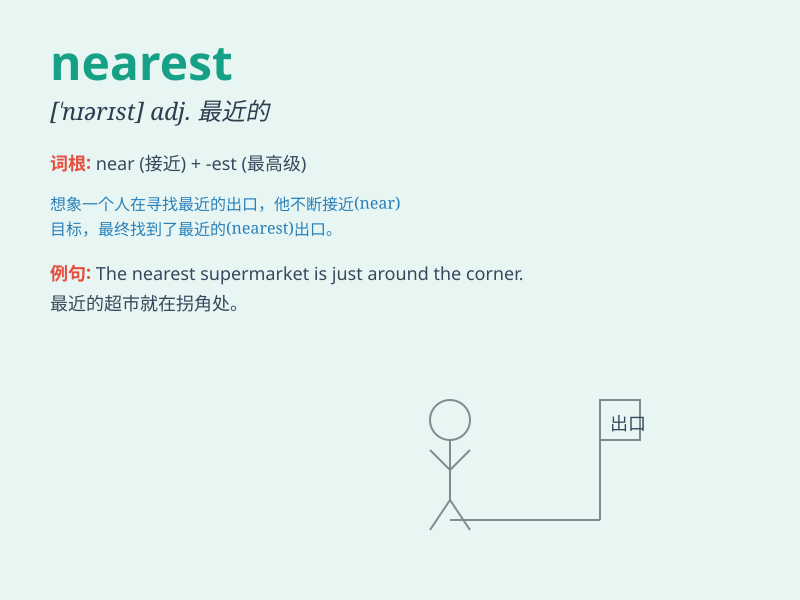

## nearest

**英音:** _[ˈnɪərɪst]_ **美音:** _[ˈnɪrɪst]_

**译义:** *最近的，最近处的；最靠近的*

### 短语

+ **the nearest town:** _最近的城镇_

+ **nearest relative:** _最近的亲属_

+ **nearest hospital:** _最近的医院_

+ **nearest exit:** _最近的出口_

+ **nearest future:** _不久的将来_

### 例句

#### 例句1

> **The nearest supermarket is two blocks away.**

**中文翻译:** 最近的超市在两个街区之外。

**单词释义:** 最近的

#### 例句2

> **He went to the nearest hospital when he felt ill.**

**中文翻译:** 他生病时去了最近的医院。

**单词释义:** 最近的

#### 例句3

> **Please find the nearest exit in case of emergency.**

**中文翻译:** 万一有紧急情况，请找到最近的出口。

**单词释义:** 最近的

### 背诵小故事

> One day, I was lost in a strange city. I asked a local for the
nearest hospital. He kindly pointed me in the right direction. With his
help, I found it quickly. The word \'nearest\' reminds me of this
helpful encounter.

**有一天，我在一个陌生的城市迷路了。我问一个当地人最近的医院在哪。他友好地给我指明了正确的方向。在他的帮助下，我很快就找到了。'nearest'这个单词让我想起了这次有用的相遇。**

### 图义

