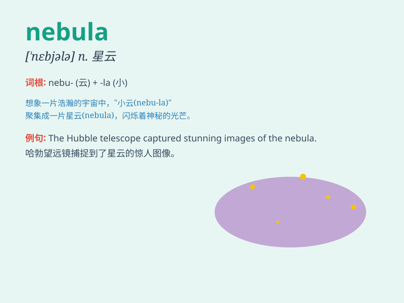

## nebula

**英音:** _[\'nebjʊlə]_ **美音:** _[\'nɛbjələ]_

**译义:** *n.星云,云翳*

### 短语

+ **emission nebula:** _发射星云_

+ **reflection nebula:** _反射星云_

+ **dark nebula:** _暗星云_

+ **planetary nebula:** _行星状星云_

+ **nebula gas:** _星云气体_

### 例句

#### 例句1

> **The nebula was a beautiful sight through the telescope.**

**中文翻译:** 通过望远镜看到的星云非常美丽。

**单词释义:** 星云

#### 例句2

> **Astronomers study the formation and evolution of nebulae.**

**中文翻译:** 天文学家研究星云的形成和演化。

**单词释义:** 星云

#### 例句3

> **The colorful nebula seemed to hold many secrets of the
universe.**

**中文翻译:** 那色彩斑斓的星云似乎蕴藏着许多宇宙的秘密。

**单词释义:** 星云

### 背诵小故事

> In a distant galaxy, a brave astronaut named Tom encountered a
mysterious and beautiful nebula. It was like a colorful cloud, filled
with gases and dust. Tom was amazed by the nebula\'s charm and vowed to
explore its secrets.

**在一个遥远的星系中，一位名叫汤姆的勇敢宇航员遇到了一个神秘而美丽的星云。它就像一朵五彩斑斓的云，充满了气体和尘埃。汤姆对星云的魅力感到惊讶，并发誓要探索它的秘密。**

### 图义

