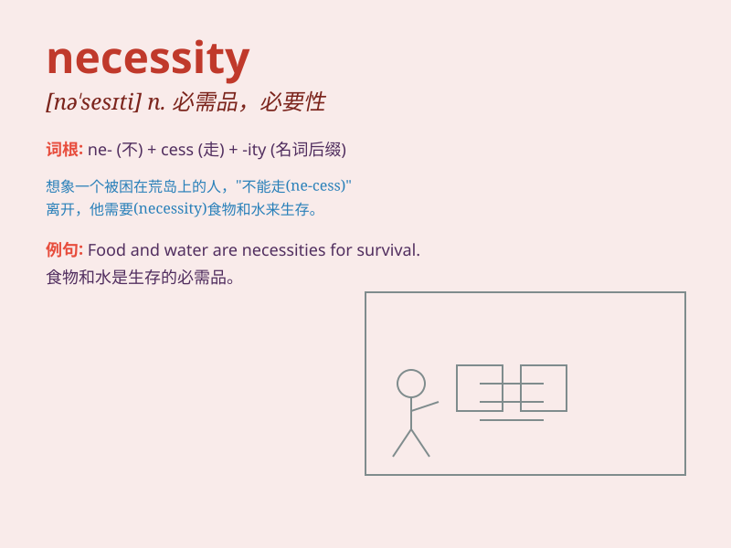

## necessity

**英音:** _[nɪ\'sesɪtɪ]_ **美音:** _[nə\'sɛsəti]_

**译义:** *n.必要性,需要,(常 pl.) 必需品*

### 短语

+ **of necessity:** _必然；不可避免地_

+ **out of necessity:** _出于必要_

+ **economic necessity:** _经济需要_

+ **basic necessity:** _基本必需品_

+ **necessity is the mother of invention:** _需要乃发明之母_

### 例句

#### 例句1

> **The necessity of wearing a mask during the pandemic cannot be
overstated.**

**中文翻译:** 疫情期间戴口罩的必要性怎么强调都不为过。

**单词释义:** 必要；需要

#### 例句2

> **Water is a basic necessity for human survival.**

**中文翻译:** 水是人类生存的基本必需品。

**单词释义:** 必需品；必要条件

#### 例句3

> **In some cases, borrowing money becomes a necessity.**

**中文翻译:** 在某些情况下，借钱成为一种必要。

**单词释义:** 必要；需要

### 背诵小故事

> A traveler was lost in a desert. Water and food became a necessity.
Without them, he couldn\'t survive. Finally, he found an oasis and
understood the true meaning of necessity.

**一位旅行者在沙漠中迷路了。水和食物成了必需品。没有它们，他无法生存。最后，他找到了一片绿洲，明白了必需品的真正含义。**

### 图义

