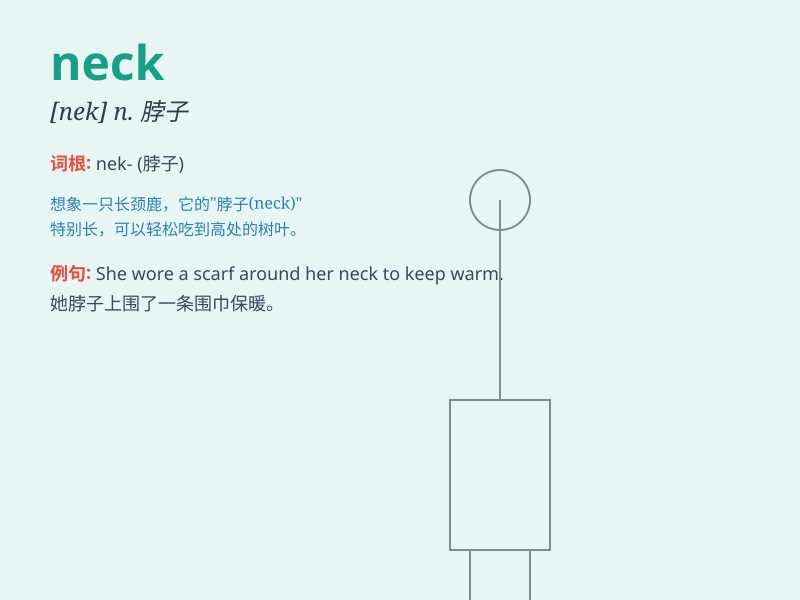

## neck

**英音:** _[nek]_ **美音:** _[nɛk]_

**译义:** *n.脖子,颈,颈壮物*

### 短语

+ **neck and neck:** _并驾齐驱；不分上下_

+ **bottle neck:** _瓶颈；障碍物_

+ **stiff neck:** _落枕；脖子发僵_

+ **neck of the woods:** _附近一带；某地方_

+ **up to one\'s neck:** _深陷于；忙得不可开交_

### 例句

#### 例句1

> **She wore a necklace around her neck.**

**中文翻译:** 她脖子上戴着一条项链。

**单词释义:** 脖子

#### 例句2

> **The giraffe has a long neck.**

**中文翻译:** 长颈鹿的脖子很长。

**单词释义:** 脖子

#### 例句3

> **He broke his neck in the car accident.**

**中文翻译:** 他在车祸中折断了脖子。

**单词释义:** 脖子

### 背诵小故事

> A giraffe has a very long neck. It uses its neck to reach the leaves
on tall trees. One day, a little monkey wanted to play a trick. It tied
a colorful ribbon around the giraffe\'s neck. The giraffe was very
happy.

**一只长颈鹿有很长的脖子。它用脖子够到高树上的叶子。有一天，一只小猴子想搞恶作剧。它在长颈鹿的脖子上系了一条彩色的丝带。长颈鹿非常高兴。**

### 图义

