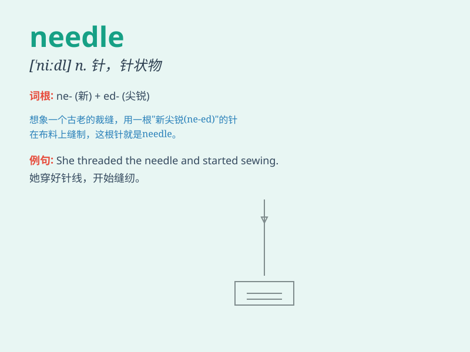

## needle

**英音:** _[\'niːd(ə)l]_ **美音:** _[\'nidl]_

**译义:** *n.针*

### 短语

+ **needle point:** _针尖_

+ **needle thread:** _缝纫线_

+ **needle exchange:**
_针头交换（指为减少疾病传播而进行的安全注射器交换项目）_

+ **sewing needle:** _缝衣针_

+ **knitting needle:** _编织针_

### 例句

#### 例句1

> **The nurse inserted the needle into my arm.**

**中文翻译:** 护士把针插入我的手臂。

**单词释义:** 针

#### 例句2

> **She threaded the needle with great care.**

**中文翻译:** 她小心翼翼地穿针。

**单词释义:** 针

#### 例句3

> **The pine tree\'s needles were sharp and prickly.**

**中文翻译:** 松树的针又锋利又带刺。

**单词释义:** 针叶

### 背诵小故事

> A little mouse was lost in a big maze. It searched everywhere and
finally found a needle. The needle became its guide and led the mouse
out of the maze. So, remember, a needle can be a helpful guide, just
like \'needle\' in English.

**一只小老鼠在一个大迷宫里迷路了。它到处寻找，最后找到了一根针。这根针成了它的向导，带着老鼠走出了迷宫。所以，记住，针可以是一个有用的指引，就像英语里的\'needle\'。**

### 图义

