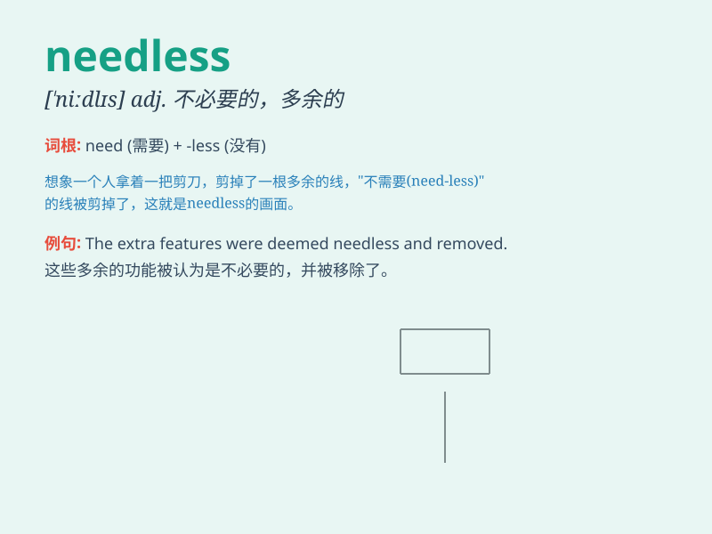

## needless

**英音:** _[\'niːdlɪs]_ **美音:** _[\'nidləs]_

**译义:** *adj.不需要的,不必要的*

### 短语

+ **needless to say:** _不用说；不必说_

+ **needless expense:** _不必要的开支_

+ **needless worry:** _不必要的担心_

+ **needless risk:** _不必要的风险_

+ **needless complication:** _不必要的复杂情况_

### 例句

#### 例句1

> **Needless to say, he was very angry.**

**中文翻译:** 不用说，他非常生气。

**单词释义:** 不用说；不必说

#### 例句2

> **It was a needless mistake.**

**中文翻译:** 这是一个不必要的错误。

**单词释义:** 不必要的；多余的

#### 例句3

> **Needless expenses should be avoided.**

**中文翻译:** 应避免不必要的开支。

**单词释义:** 不必要的；无用的

### 背诵小故事

> Once upon a time, a man had many things but still kept buying. His
friend said, \'It\'s needless. You already have enough.\' Meaning it was
unnecessary. So, remember, needless means not necessary.

**从前，有个人已经拥有很多东西但仍不停地买。他的朋友说：'这是没必要的。你已经有足够的了。'这就表示这是不必要的。所以，记住，needless
意思是不必要的。**

### 图义

