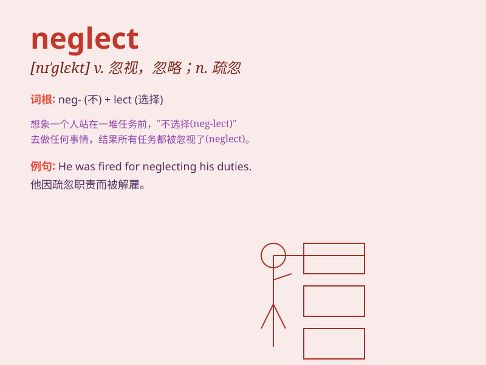

## neglect

**英音:** _[nɪ\'glekt]_ **美音:** _[nɪ\'glɛkt]_

**译义:** *vt.忽视,疏忽,漏做n.忽视,疏忽,漏做*

### 短语

+ **neglect of duty:** _玩忽职守_

+ **fall into neglect:** _被忽视；逐渐被遗忘_

+ **neglect one\'s health:** _忽视自己的健康_

+ **neglect to do sth:** _忘记做某事；疏忽做某事_

+ **utter neglect:** _完全忽视_

### 例句

#### 例句1

> **He neglected his studies and failed the exam.**

**中文翻译:** 他荒废了学业，考试没及格。

**单词释义:** 忽视

#### 例句2

> **The garden was neglected and overgrown with weeds.**

**中文翻译:** 花园无人照管，杂草丛生。

**单词释义:** 疏于照料

#### 例句3

> **Don\'t neglect to lock the door when you leave.**

**中文翻译:** 离开时不要忘记锁门。

**单词释义:** 忘记；忽略

### 背诵小故事

> A busy farmer always had a lot of work to do. One day, he neglected
to feed his cows, causing them to be hungry. He realized his mistake and
promised never to neglect his duties again.

**一位忙碌的农夫总有很多工作要做。有一天，他疏忽了给奶牛喂食，导致它们挨饿。他意识到自己的错误，并承诺再也不会疏忽自己的职责。**

### 图义

