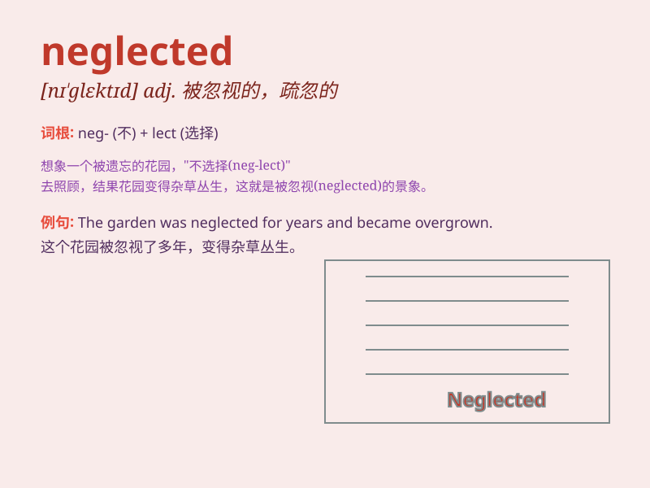

## neglected

**英音:** _[nɪ\'glektɪd]_ **美音:** _[nɪ\'ɡlɛktɪd]_

**译义:** *adj.被忽视的*

### 短语

+ **neglected area:** _被忽视的地区_

+ **neglected child:** _被忽视的孩子_

+ **neglected garden:** _被疏于打理的花园_

+ **neglected duty:** _被忽略的职责_

+ **neglected problem:** _被忽视的问题_

### 例句

#### 例句1

> **The neglected garden was overgrown with weeds.**

**中文翻译:** 被忽视的花园杂草丛生。

**单词释义:** 被忽视的

#### 例句2

> **He felt neglected by his friends when they didn\'t invite him to
the party.**

**中文翻译:** 当朋友们没有邀请他参加聚会时，他感觉自己被忽视了。

**单词释义:** 被忽视

#### 例句3

> **The neglected child was in desperate need of love and
attention.**

**中文翻译:** 被忽视的孩子迫切需要爱和关注。

**单词释义:** 被疏于照顾的

### 背诵小故事

> A poor puppy was neglected by its owner. It was left alone in the
cold with no food or care. But one day, a kind girl found it and gave it
the love it deserved. \'neglected\' means being given little or no
attention or care.

**一只可怜的小狗被它的主人忽视了。它独自被留在寒冷中，没有食物和照顾。但有一天，一个善良的女孩发现了它，并给予了它应得的爱。\'neglected\'意思是被很少关注或照顾。**

### 图义

