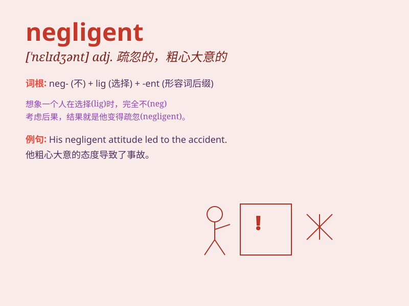

## negligent

**英音:** _[\'neɡlɪdʒənt]_ **美音:** _[\'nɛɡlɪdʒənt]_

**译义:** *adj.疏忽的,粗心大意的*

### 短语

+ **negligent act:** _疏忽行为_

+ **negligent driving:** _疏忽驾驶_

+ **negligent mistake:** _疏忽错误_

+ **negligent performance:** _疏忽的表现_

+ **negligent supervision:** _疏忽监管_

### 例句

#### 例句1

> **The doctor was negligent in his treatment of the patient.**

**中文翻译:** 医生对病人的治疗疏忽了。

**单词释义:** 疏忽的；粗心大意的

#### 例句2

> **The company was found negligent in its safety procedures.**

**中文翻译:** 该公司被发现疏忽了安全程序。

**单词释义:** 疏忽的；玩忽职守的

#### 例句3

> **He was negligent of his duties and got fired.**

**中文翻译:** 他玩忽职守，被解雇了。

**单词释义:** 疏忽职守的

### 背诵小故事

> A doctor was negligent and forgot to check a patient\'s vital signs.
As a result, the patient\'s condition worsened. This shows that being
negligent can have serious consequences.

**一位医生疏忽大意，忘记检查病人的生命体征。结果，病人的病情恶化了。这表明疏忽可能会产生严重的后果。**

### 图义

