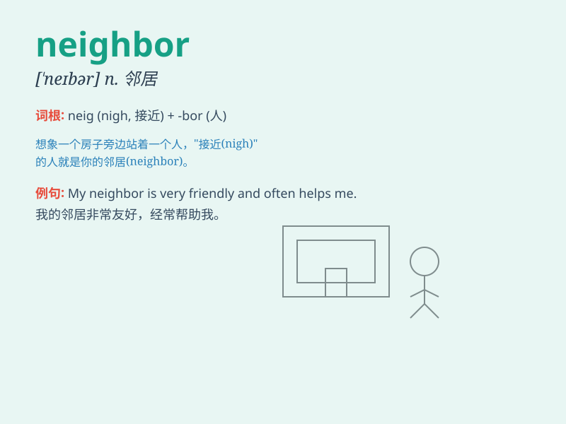

## neighbor

**英音:** _[\'neɪbə]_ **美音:** _[\'nebɚ]_

**译义:** *n.\<美> 邻居,邻国*

### 短语

+ **good neighbor:** _好邻居_

+ **neighbor country:** _邻国_

+ **next-door neighbor:** _隔壁邻居_

+ **neighbor relationship:** _邻里关系_

+ **neighbor town:** _邻镇_

### 例句

#### 例句1

> **My neighbor is a kind person.**

**中文翻译:** 我的邻居是个善良的人。

**单词释义:** 邻居

#### 例句2

> **I often borrow tools from my neighbor.**

**中文翻译:** 我经常向我的邻居借工具。

**单词释义:** 邻居

#### 例句3

> **The neighbors had a party last night.**

**中文翻译:** 邻居们昨晚举办了一个派对。

**单词释义:** 邻居们

### 背诵小故事

> One day, I lost my key. My neighbor saw my worry and kindly helped me
look for it. Finally, we found it in the garden. A good neighbor is like
a friend in need.

**有一天，我丢了钥匙。我的邻居看到我很着急，好心地帮我一起找。最后，我们在花园里找到了。一个好邻居就像患难时的朋友。**

### 图义

