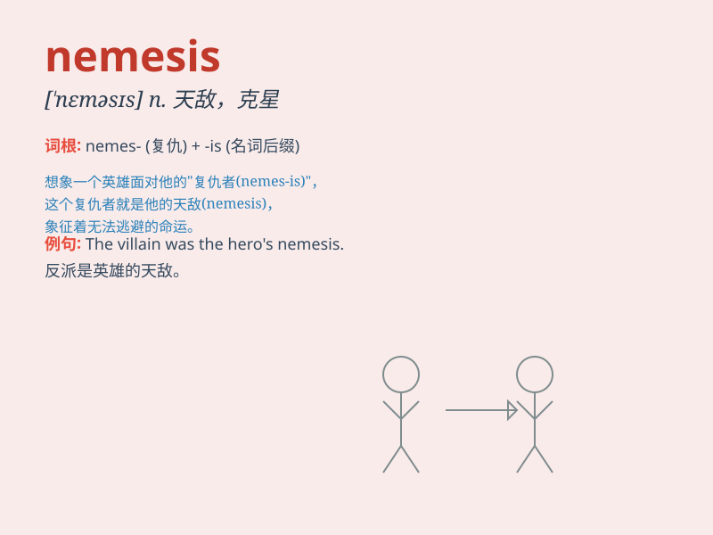

## nemesis

**英音:** _[ˈneməsɪs]_ **美音:** _[ˈneməsɪs]_

**译义:** *n.报应,复仇女神*

### 短语

+ **arch-nemesis:** _主要的死敌_

+ **nemesis of evil:** _邪恶的克星_

+ **invincible nemesis:** _不可战胜的劲敌_

+ **sworn nemesis:** _不共戴天的仇敌_

+ **nemesis in disguise:** _伪装的克星_

### 例句

#### 例句1

> **The new tax law proved to be the nemesis of many small
businesses.**

**中文翻译:** 新的税法被证明是许多小企业的克星。

**单词释义:** 克星；劲敌

#### 例句2

> **He believed that fate would eventually deliver his nemesis.**

**中文翻译:** 他相信命运最终会给他送来劲敌。

**单词释义:** 报应；应得的惩罚

#### 例句3

> **Her political nemesis emerged during the election campaign.**

**中文翻译:** 在竞选活动期间，她的政治对手出现了。

**单词释义:** 对手；敌人

### 背诵小故事

> A brave knight was always victorious in battles, but one day, he met
a powerful enemy named Nemesis. This enemy was so strong and smart that
it became the knight\'s greatest challenge. Eventually, the knight had
to use all his skills to defeat Nemesis.

**一位勇敢的骑士在战斗中总是胜利，但有一天，他遇到了一个强大的敌人叫涅墨西斯。这个敌人如此强大和聪明，成为了骑士最大的挑战。最终，骑士不得不使出浑身解数来打败涅墨西斯。**

### 图义

