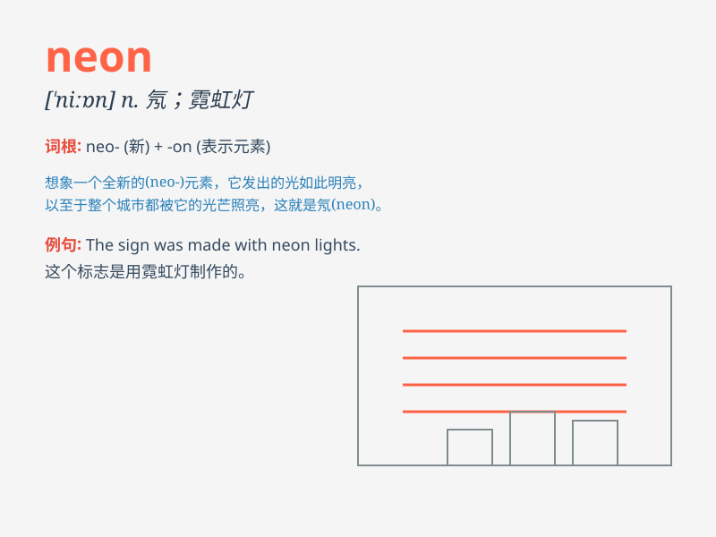

## neon

**英音:** _[\'niːɒn]_ **美音:** _[\'niɑn]_

**译义:** *n.[化]氖*

### 短语

+ **neon light:** _霓虹灯_

+ **neon sign:** _霓虹灯招牌_

+ **neon tube:** _霓虹灯管_

+ **neon color:** _霓虹色_

+ **neon gas:** _氖气_

### 例句

#### 例句1

> **The neon sign outside the store was very bright.**

**中文翻译:** 商店外面的霓虹灯招牌非常亮。

**单词释义:** 霓虹灯

#### 例句2

> **She wore a neon dress that stood out in the crowd.**

**中文翻译:** 她穿了一件在人群中很显眼的霓虹色连衣裙。

**单词释义:** 霓虹色

#### 例句3

> **The city at night was filled with neon lights.**

**中文翻译:** 夜晚的城市充满了霓虹灯。

**单词释义:** 霓虹灯

### 背诵小故事

>
想象一下，在一个黑暗的城市夜晚，有一家商店的招牌特别醒目，发出鲜艳的光芒。原来是用了很多
neon 灯管。这些 neon
灯管像魔法一样，照亮了整个街道，让人们很容易就找到了这家店。

**想象在黑暗的城市夜晚，一家商店用很多氖灯管做招牌，其光芒照亮街道，助于记住
neon（氖；霓虹灯）这个单词。**

### 图义

