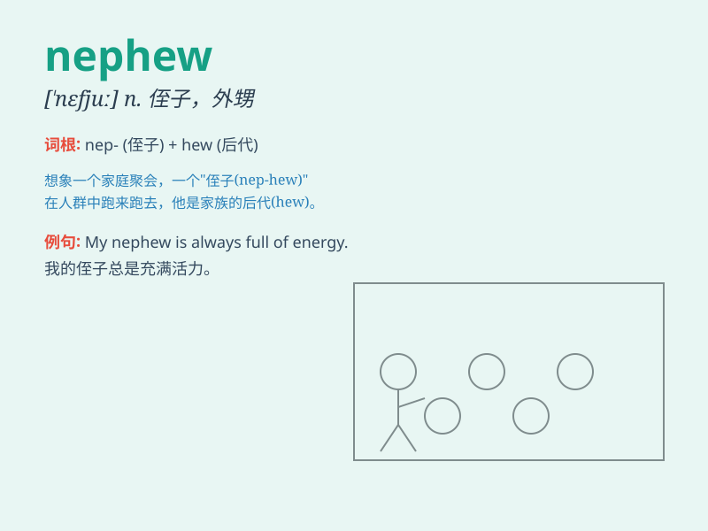

## nephew

**英音:** _[\'nefjuː; \'nevjuː]_ **美音:** _[\'nɛfju]_

**译义:** *n.侄子,外甥*

### 短语

+ **elder nephew:** _年长的侄子_

+ **young nephew:** _年幼的侄子_

+ **dear nephew:** _亲爱的侄子_

+ **lovely nephew:** _可爱的侄子_

+ **naughty nephew:** _调皮的侄子_

### 例句

#### 例句1

> **I have a nephew who loves playing football.**

**中文翻译:** 我有一个喜欢踢足球的侄子。

**单词释义:** 侄子

#### 例句2

> **Her nephew is very smart and polite.**

**中文翻译:** 她的侄子非常聪明和有礼貌。

**单词释义:** 侄子

#### 例句3

> **He took his nephew to the zoo last weekend.**

**中文翻译:** 上周末他带他的侄子去了动物园。

**单词释义:** 侄子

### 背诵小故事

> One day, I met a little boy at a party. My sister introduced him to
me and said, \'This is my son, your nephew.\' From then on, I remembered
the word \'nephew\' as a boy related to my sister\'s family.

**有一天，我在一个聚会上遇到一个小男孩。我姐姐向我介绍说：'这是我儿子，你的外甥。'从那以后，我记住了'nephew'这个词，表示姐姐家的男孩。**

### 图义

