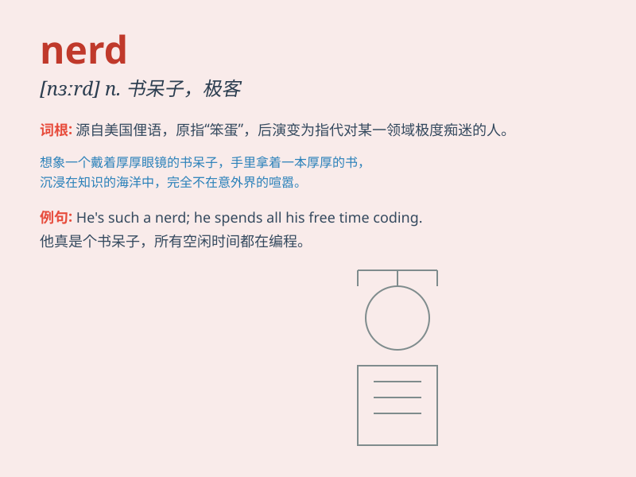

## nerd

**英音:** _[nɜːd]_ **美音:** _[nɝd]_

**译义:** *n.讨厌的人,卑微的人*

### 短语

+ **computer nerd:** _电脑迷_

+ **math nerd:** _数学迷_

+ **book nerd:** _书呆子_

+ **science nerd:** _科学迷_

+ **nerd out:** _对某事极度痴迷_

### 例句

#### 例句1

> **He\'s such a nerd when it comes to computer programming.**

**中文翻译:** 当谈到计算机编程时，他就是个书呆子。

**单词释义:** 书呆子；电脑迷

#### 例句2

> **The nerd spent all weekend reading science fiction novels.**

**中文翻译:** 这个书呆子整个周末都在看科幻小说。

**单词释义:** 痴迷于某事物的人；书呆子

#### 例句3

> **Don\'t be a nerd and come have some fun with us!**

**中文翻译:** 别做个书呆子，来和我们一起找点乐子！

**单词释义:** 书呆子；无趣的人

### 背诵小故事

>
从前有个叫小明的孩子，他整天只知道读书和研究复杂的数学题，对其他娱乐活动毫无兴趣。同学们都叫他
nerd，因为他太痴迷于知识，显得与大家格格不入。

**从前有个叫小明的孩子，他总是读书和研究数学，同学们觉得他太痴迷知识，与大家不同，就叫他书呆子。**

### 图义

