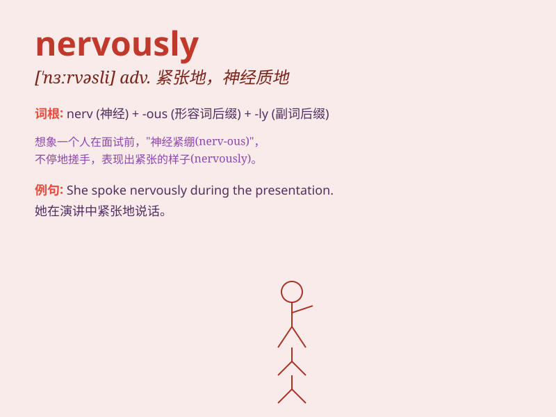

## nervously

**英音:** _[ˈnɜːvɪsli]_ **美音:** _[ˈnɜːrvəsli]_

**译义:** *副词，紧张地，焦虑不安地；神经质地*

### 短语

+ **nervously glance:** _紧张地瞥一眼_

+ **nervously fidget:** _紧张地坐立不安_

+ **nervously await:** _紧张地等待_

+ **nervously stammer:** _紧张地结巴_

+ **nervously pace:** _紧张地踱步_

### 例句

#### 例句1

> **She bit her lip nervously as she waited for the results.**

**中文翻译:** 她在等待结果时紧张地咬着嘴唇。

**单词释义:** 紧张地

#### 例句2

> **He paced nervously back and forth in the room.**

**中文翻译:** 他在房间里紧张地来回踱步。

**单词释义:** 紧张地

#### 例句3

> **The students answered the questions nervously during the
exam.**

**中文翻译:** 学生们在考试期间紧张地回答问题。

**单词释义:** 紧张地

### 背诵小故事

> One day, Tom was waiting nervously for his exam results. His heart
was beating fast. He paced back and forth, hands shaking. Finally, when
he got the good news, he relaxed.

**一天，汤姆紧张地等待着他的考试成绩。他心跳很快。他来回踱步，双手颤抖。最后，当他得到好消息时，他放松了下来。**

### 图义

