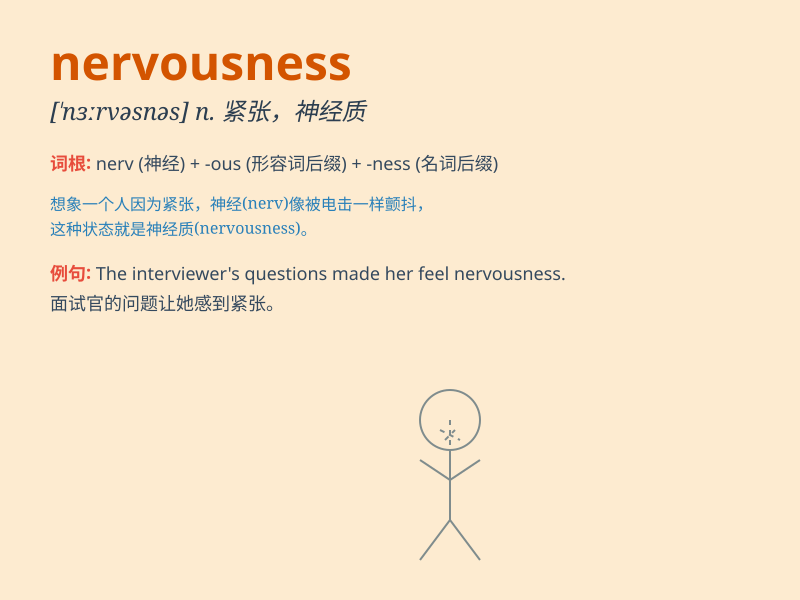

## nervousness

**英音:** _[ˈnɜːvəsnəs]_ **美音:** _[ˈnɜːrvəsnes]_

**译义:** *n.紧张，不安，神经质*

### 短语

+ **feel nervousness:** _感到紧张_

+ **overcome nervousness:** _克服紧张_

+ **reduce nervousness:** _减轻紧张_

+ **nervousness attack:** _紧张发作_

+ **nervousness disorder:** _紧张症_

### 例句

#### 例句1

> **Her nervousness was obvious as she gave the presentation.**

**中文翻译:** 她做报告时的紧张是显而易见的。

**单词释义:** 紧张；焦虑

#### 例句2

> **He tried to hide his nervousness before the exam.**

**中文翻译:** 他在考试前试图掩饰自己的紧张。

**单词释义:** 紧张；不安

#### 例句3

> **The actor\'s nervousness showed in his trembling voice.**

**中文翻译:** 这位演员的紧张表现在他颤抖的声音中。

**单词释义:** 紧张情绪

### 背诵小故事

> One day, Tom had to give a speech in front of a large crowd. His
heart was pounding and he felt a sense of nervousness. His hands were
shaking and his mind went blank. But he took a deep breath and overcame
the nervousness.

**一天，汤姆不得不当着一大群人的面演讲。他的心砰砰直跳，感到一阵紧张。他的手在颤抖，脑子一片空白。但他深吸一口气，克服了紧张情绪。**

### 图义

