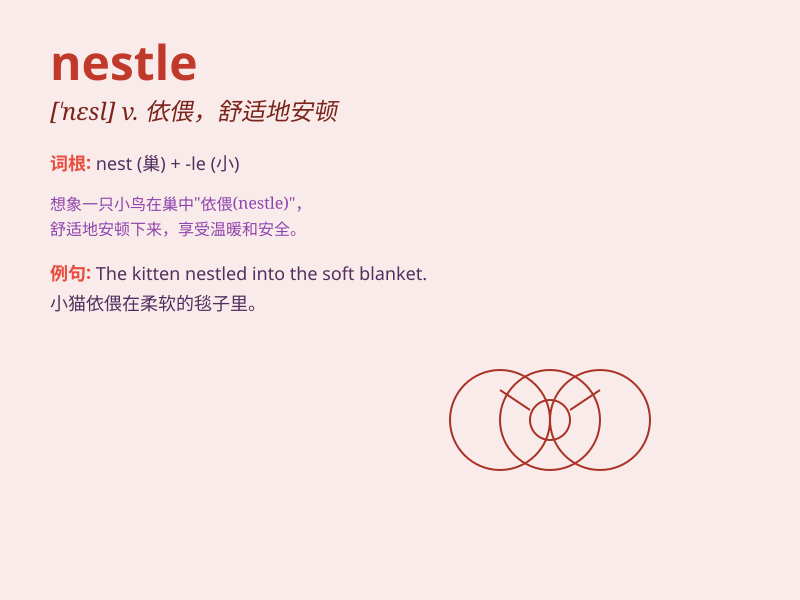

## nestle

**英音:** _[\'nes(ə)l]_ **美音:** _[\'nɛsl]_

**译义:** *vi.舒适地坐定,偎依vt.抱,安置*

### 短语

+ **nestle down:** _舒适地躺卧；安卧_

+ **nestle up:** _依偎；紧贴_

+ **nestle against:** _靠着\...\...依偎_

+ **nestle in:** _舒适地处于；安放在_

+ **nestle among:** _依偎在\...\...中间_

### 例句

#### 例句1

> **The little bird nestled in the branches of the tree.**

**中文翻译:** 这只小鸟舒适地安卧在树枝上。

**单词释义:** 舒适地安卧；偎依

#### 例句2

> **The village nestles among the mountains.**

**中文翻译:** 这个村庄坐落在群山之中。

**单词释义:** 坐落；位于

#### 例句3

> **She nestled the baby in her arms.**

**中文翻译:** 她把婴儿轻轻地搂在怀里。

**单词释义:** 轻轻地搂抱

### 背诵小故事

> A little bird was tired and found a cozy place to rest. It nestle d
itself among the soft branches and leaves, feeling safe and warm. Soon,
it fell asleep peacefully.

**一只小鸟累了，找到了一个舒适的地方休息。它把自己安放在柔软的枝叶间，感觉安全又温暖。很快，它就安静地睡着了。**

### 图义

