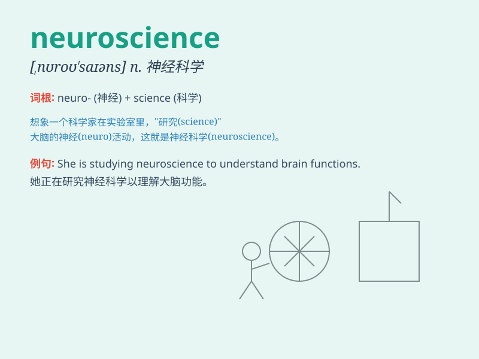

## neuroscience

**英音:** _[\'njuːrəʊsaɪəns]_ **美音:** _[,nʊro\'saɪəns;
,njʊro\'saɪəns]_

**译义:** *n.神经系统科学(指神经病学、 神经化学等)*

### 短语

+ **cognitive neuroscience:** _认知神经科学_

+ **social neuroscience:** _社会神经科学_

+ **developmental neuroscience:** _发育神经科学_

+ **clinical neuroscience:** _临床神经科学_

+ **computational neuroscience:** _计算神经科学_

### 例句

#### 例句1

> **She is majoring in neuroscience at the university.**

**中文翻译:** 她在大学里主修神经科学。

**单词释义:** 神经科学

#### 例句2

> **The advancements in neuroscience have led to new treatments for
mental disorders.**

**中文翻译:** 神经科学的进步带来了精神疾病的新疗法。

**单词释义:** 神经科学

#### 例句3

> **Neuroscience research shows that sleep is crucial for memory
consolidation.**

**中文翻译:** 神经科学研究表明，睡眠对于记忆巩固至关重要。

**单词释义:** 神经科学

### 背诵小故事

> One day, a curious student named Lily decided to explore the world of
neuroscience. She discovered how our brains control thoughts and
actions. It was like unlocking a mystery that helps us understand
ourselves better.

**有一天，一个叫莉莉的好奇学生决定探索神经科学的世界。她发现了我们的大脑是如何控制思想和行动的。这就像解开了一个能帮助我们更好地了解自己的谜团。**

### 图义

