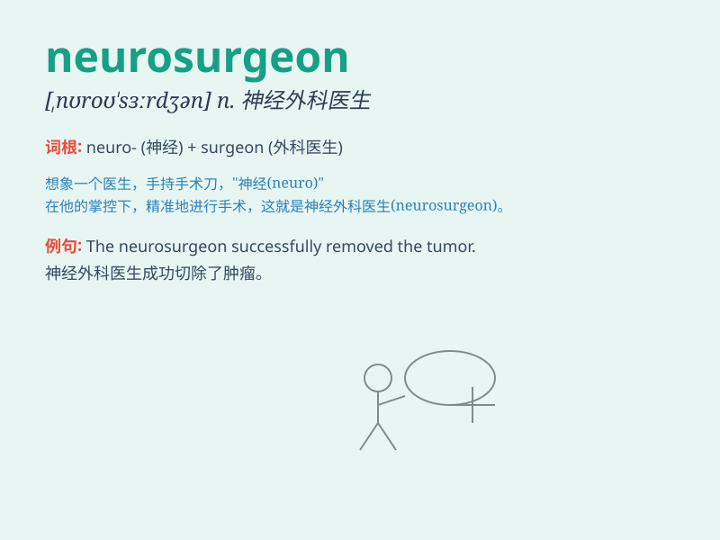

## neurosurgeon

**英音:** _[,njʊərəʊ\'sɜːdʒən]_ **美音:**
_[,njʊro\'sɝdʒən]_

**译义:** *n.神经外科医生*

### 短语

+ **neurosurgeon specialist:** _神经外科专家_

+ **experienced neurosurgeon:** _经验丰富的神经外科医生_

+ **leading neurosurgeon:** _首席神经外科医生_

+ **renowned neurosurgeon:** _著名的神经外科医生_

+ **skilled neurosurgeon:** _技术娴熟的神经外科医生_

### 例句

#### 例句1

> **The patient was referred to a renowned neurosurgeon for the
complex brain tumor.**

**中文翻译:** 这位患者因复杂的脑瘤被转介给一位著名的神经外科医生。

**单词释义:** 神经外科医生

#### 例句2

> **After the accident, he was immediately attended by a skilled
neurosurgeon.**

**中文翻译:** 事故发生后，他立即由一位技术娴熟的神经外科医生照料。

**单词释义:** 神经外科医生

#### 例句3

> **The neurosurgeon performed a delicate operation to save the
patient\'s life.**

**中文翻译:** 这位神经外科医生进行了一场精细的手术来挽救患者的生命。

**单词释义:** 神经外科医生

### 背诵小故事

>
想象一下，有个勇敢的人叫杰克，他梦想成为一名能拯救大脑的英雄。于是他努力学习，最终成为了一名
neurosurgeon（神经外科医生），专门在复杂的大脑世界里为患者解除病痛。

**想象一下，有个叫杰克的人，他立志成为能拯救大脑的英雄，努力后成为了神经外科医生，专门为患者解决大脑相关病痛。**

### 图义

