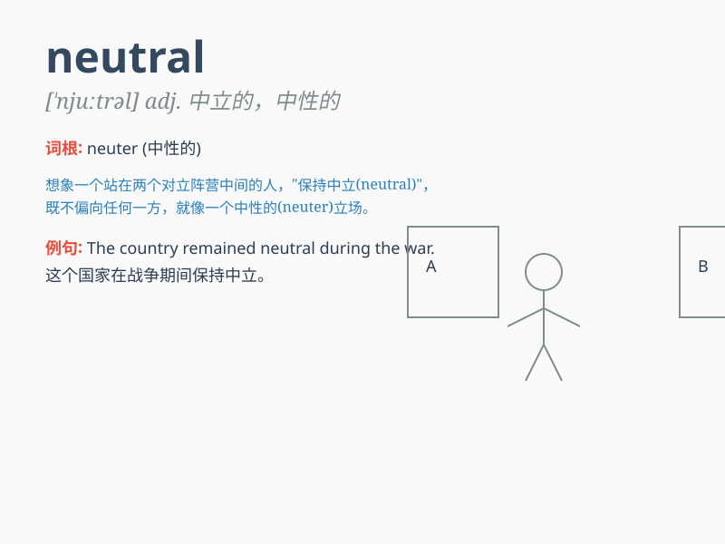

## neutral

**英音:** _[\'njuːtr(ə)l]_ **美音:** _[ˈnutrəl]_

**译义:**
*n.中立者,中立国,非彩色,齿轮的空档adj.中立的,中立国的,中性的,无确定性质的,(颜色等)不确定的*

### 短语

+ **neutral zone:** _中立区_

+ **neutral position:** _中立位置；空档位置_

+ **neutral color:** _中性色_

+ **neutral country:** _中立国_

+ **neutral tone:** _中性语气_

### 例句

#### 例句1

> **The country remained neutral during the war.**

**中文翻译:** 这个国家在战争期间保持中立。

**单词释义:** 中立的

#### 例句2

> **The referee\'s decision was neutral and fair.**

**中文翻译:** 裁判的决定是中立且公平的。

**单词释义:** 中立的；公平的

#### 例句3

> **The color of this room is neutral, neither too bright nor too
dark.**

**中文翻译:** 这个房间的颜色是中性的，既不太亮也不太暗。

**单词释义:** 中性的

### 背诵小故事

> A spaceship was in a dangerous situation. The captain needed to find
a neutral zone to avoid conflicts. Finally, they found it and were safe.
\'Neutral\' means not supporting either side in a conflict or dispute.

**一艘宇宙飞船处于危险境地。船长需要找到一个中立区域以避免冲突。最终，他们找到了，安全了。\'neutral\'意思是在冲突或争端中不支持任何一方。**

### 图义

