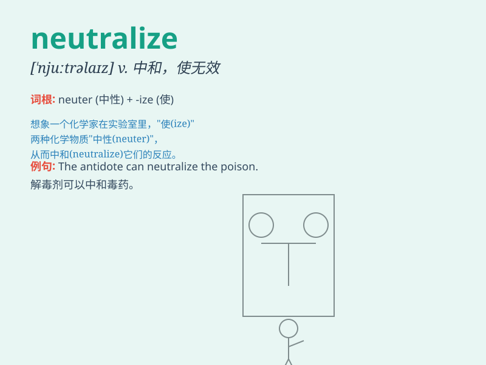

## neutralize

**英音:** _[ˈnjuːtrəlaɪz]_ **美音:** _[ˈnuːtrəlaɪz]_

**译义:** *v.压制*

### 短语

+ **neutralize an acid:** _中和一种酸_

+ **neutralize an enemy:** _使敌人失去战斗力_

+ **neutralize a threat:** _消除威胁_

+ **neutralize the effect:** _抵消影响_

+ **neutralize a poison:** _解毒_

### 例句

#### 例句1

> **The acid was neutralized by the base.**

**中文翻译:** 酸被碱中和了。

**单词释义:** 中和

#### 例句2

> **The army managed to neutralize the enemy\'s threat.**

**中文翻译:** 军队设法消除了敌人的威胁。

**单词释义:** 消除；使无效

#### 例句3

> **The new drug can neutralize the virus.**

**中文翻译:** 这种新药能中和病毒。

**单词释义:** 中和

### 背诵小故事

> In a chemical lab, a dangerous liquid was threatening to cause harm.
But the scientist added a special substance to neutralize it. The
special substance balanced the dangerous liquid\'s properties and made
it harmless, just like how \'neutralize\' means to make something
ineffective or harmless.

**在一个化学实验室里，一种危险的液体有造成危害的威胁。但是科学家添加了一种特殊的物质来中和它。这种特殊物质平衡了危险液体的特性，使其无害，这就像'neutralize'这个单词意味着使某物无效或无害。**

### 图义

