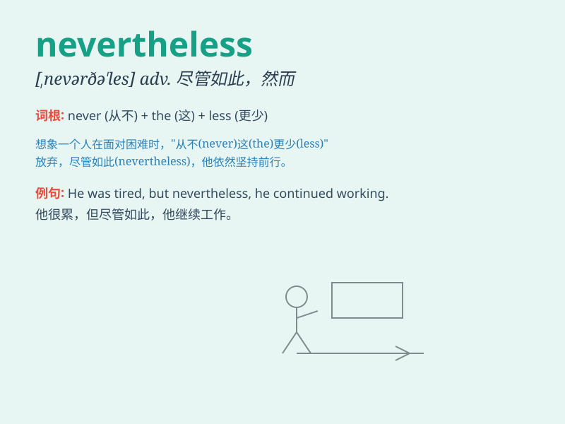

## nevertheless

**英音:** _[nevəðə\'les]_ **美音:** _[,nɛvɚðə\'lɛs]_

**译义:** * conj.然而,不过adv.仍然,不过*

### 短语

+ **nevertheless still:** _不过仍然_

+ **nevertheless yet:** _然而还是_

+ **nevertheless though:** _尽管如此不过_

+ **nevertheless however:** _然而可是_

+ **nevertheless all the same:** _仍然如故_

### 例句

#### 例句1

> **The weather was bad. Nevertheless, we decided to go for a
walk.**

**中文翻译:** 天气很糟糕。然而，我们还是决定去散步。

**单词释义:** 然而，不过

#### 例句2

> **He is very tired. Nevertheless, he keeps working.**

**中文翻译:** 他非常累。尽管如此，他仍继续工作。

**单词释义:** 尽管如此

#### 例句3

> **The task was difficult. Nevertheless, she completed it on
time.**

**中文翻译:** 这个任务很难。不过，她按时完成了。

**单词释义:** 不过

### 背诵小故事

> A brave adventurer was lost in the forest. It was very dangerous.
Nevertheless, he didn\'t give up and finally found his way out. This
shows that \'nevertheless\' means in spite of that; however.

**一位勇敢的探险家在森林中迷路了。情况非常危险。然而，他没有放弃，最终找到了出路。这表明'nevertheless'意思是尽管如此；然而。**

### 图义

