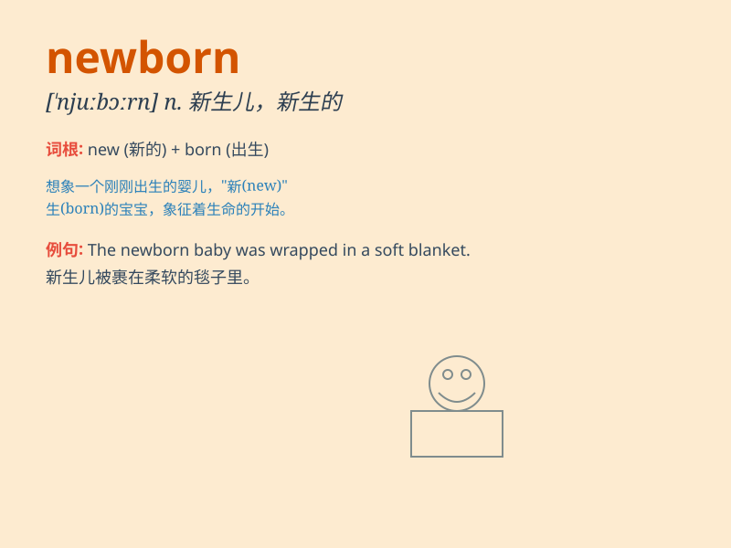

## newborn

**英音:** _[njuː\'bɔːn; \'njuːbɔːn]_ **美音:**
_[\'nubɔrn]_

**译义:** *n.婴儿adj.新生的,再生的*

### 短语

+ **newborn baby:** _新生儿_

+ **newborn calf:** _新生的小牛_

+ **newborn kitten:** _新生的小猫_

+ **newborn lamb:** _新生的小羊_

+ **newborn puppy:** _新生的小狗_

### 例句

#### 例句1

> **The newborn baby was crying loudly.**

**中文翻译:** 这个新生的婴儿正在大声啼哭。

**单词释义:** 新生的

#### 例句2

> **Newborn kittens are very cute.**

**中文翻译:** 新生的小猫非常可爱。

**单词释义:** 新生的

#### 例句3

> **The hospital has a special ward for newborns.**

**中文翻译:** 这家医院有一个专门为新生儿设立的病房。

**单词释义:** 新生儿

### 背诵小故事

> A little baby was just born in the hospital. Everyone was excited to
see the newborn, with its tiny hands and feet. The newborn was like a
fresh start, bringing joy and hope to the family.

**一个小婴儿刚刚在医院出生。每个人看到这个新生儿都很兴奋，他有着小小的手和脚。这个新生儿就像一个新的开始，给家庭带来了欢乐和希望。**

### 图义

