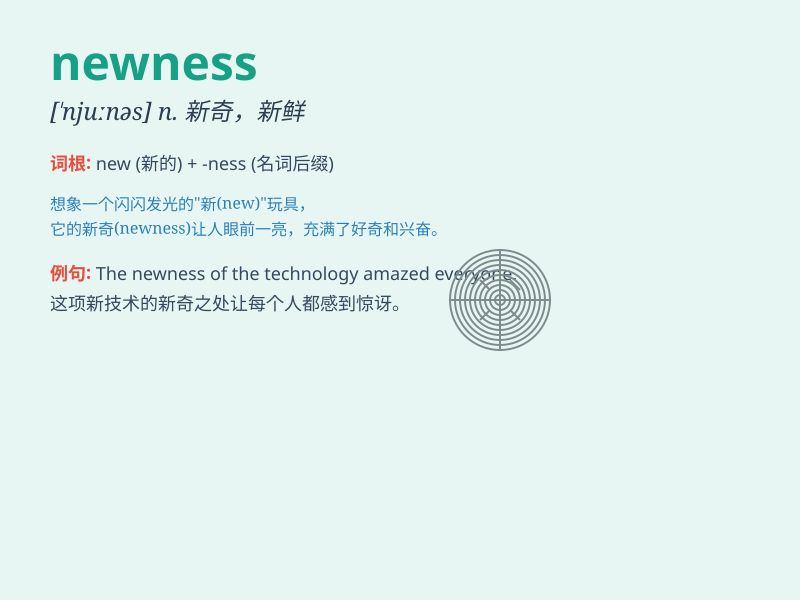

## newness

**英音:** _[njuːnəs]_ **美音:** _[njuːnəs]_

**译义:** *n.崭新,新奇*

### 短语

+ **sense of newness:** _新鲜感_

+ **the newness of life:** _生活的新奇_

+ **experience newness:** _体验新奇_

+ **newness factor:** _新奇因素_

+ **appreciate newness:** _欣赏新奇_

### 例句

#### 例句1

> **The newness of the technology excited the scientists.**

**中文翻译:** 这项技术的新颖性让科学家们感到兴奋。

**单词释义:** 新颖；新奇

#### 例句2

> **She was attracted by the newness of the city.**

**中文翻译:** 她被这座城市的新奇所吸引。

**单词释义:** 新奇；新鲜

#### 例句3

> **The newness of the idea gave it an edge over the competition.**

**中文翻译:** 这个想法的新颖之处使其在竞争中占据优势。

**单词释义:** 新颖；创新

### 背诵小故事

> One day, a little girl entered a strange room full of newness. There
were new toys, new books, and new paintings. She was so excited by all
the new things. The newness made her day wonderful.

**有一天，一个小女孩走进了一个充满新奇的陌生房间。那里有新玩具、新书和新画。所有这些新东西让她兴奋不已。这种新奇感让她这一天都很美好。**

### 图义

