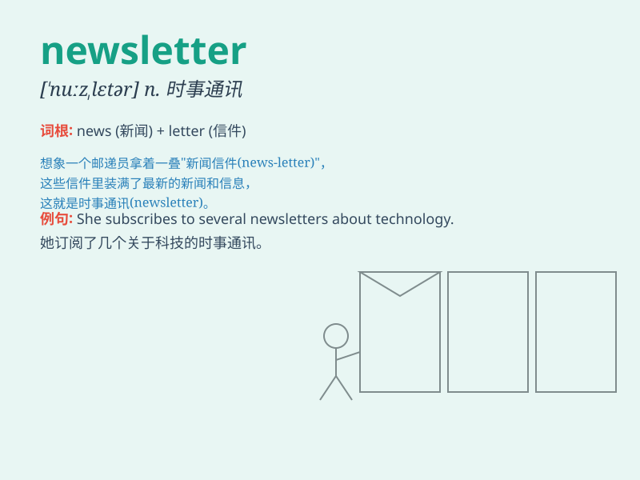

## newsletter

**英音:** _[\'njuːzletə]_ **美音:** _[\'nuzlɛtɚ]_

**译义:** *n.时事通讯*

### 短语

+ **subscribe to a newsletter:** _订阅一份时事通讯_

+ **send out a newsletter:** _发送一份时事通讯_

+ **weekly newsletter:** _每周时事通讯_

+ **company newsletter:** _公司时事通讯_

+ **electronic newsletter:** _电子时事通讯_

### 例句

#### 例句1

> **I always look forward to receiving the company\'s newsletter
every month.**

**中文翻译:** 我每个月总是期待收到公司的时事通讯。

**单词释义:** 时事通讯

#### 例句2

> **The school sent out a newsletter to inform parents about the
upcoming events.**

**中文翻译:** 学校发出了一份时事通讯，告知家长即将举行的活动。

**单词释义:** 时事通讯

#### 例句3

> **She subscribes to several newsletters related to her hobbies.**

**中文翻译:** 她订阅了几份与她的爱好相关的时事通讯。

**单词释义:** 时事通讯

### 背诵小故事

>
想象一下，有个小精灵每天都在收集最新的新闻（news），然后把它们整齐地写在一张纸上，像一封充满信息的信（letter），最后送到人们手中。这就是
newsletter，新闻信、时事通讯。

**想象一个小精灵收集新闻并写成信的情景来辅助记忆 newsletter
这个词，意思是新闻信、时事通讯**

### 图义

