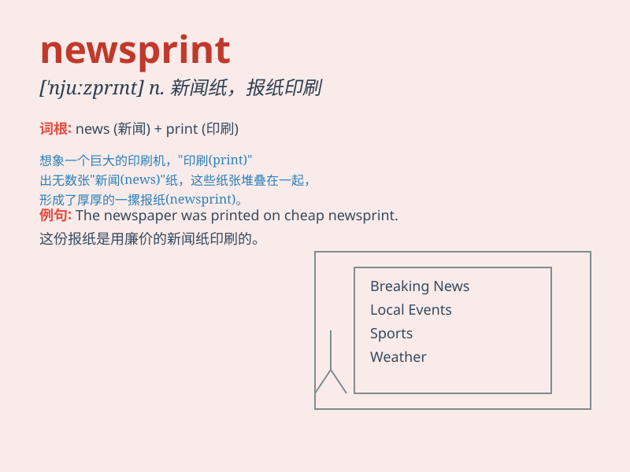

## newsprint

**英音:** _[\'njuːzprɪnt]_ **美音:** _[\'nuzprɪnt]_

**译义:** *n.新闻用纸*

### 短语

+ **newsprint paper:** _新闻纸_

+ **newsprint industry:** _新闻纸行业_

+ **newsprint mill:** _新闻纸厂_

+ **quality newsprint:** _优质新闻纸_

+ **imported newsprint:** _进口新闻纸_

### 例句

#### 例句1

> **The article was printed on cheap newsprint.**

**中文翻译:** 这篇文章印在廉价的新闻纸上。

**单词释义:** 新闻纸

#### 例句2

> **Newsprint is used for printing newspapers.**

**中文翻译:** 新闻纸用于印刷报纸。

**单词释义:** 新闻纸

#### 例句3

> **The quality of the newsprint affected the clarity of the
print.**

**中文翻译:** 新闻纸的质量影响了印刷的清晰度。

**单词释义:** 新闻纸

### 背诵小故事

> One day, a journalist was running out of newsprint to print the
latest news. He rushed to the store and shouted, \'I need more
newsprint!\' Finally, he got it and shared the news with everyone.

**有一天，一位记者的新闻纸用完了，无法印刷最新的新闻。他冲到商店大喊：'我需要更多的新闻纸！'最后，他得到了并和大家分享了新闻。**

### 图义

