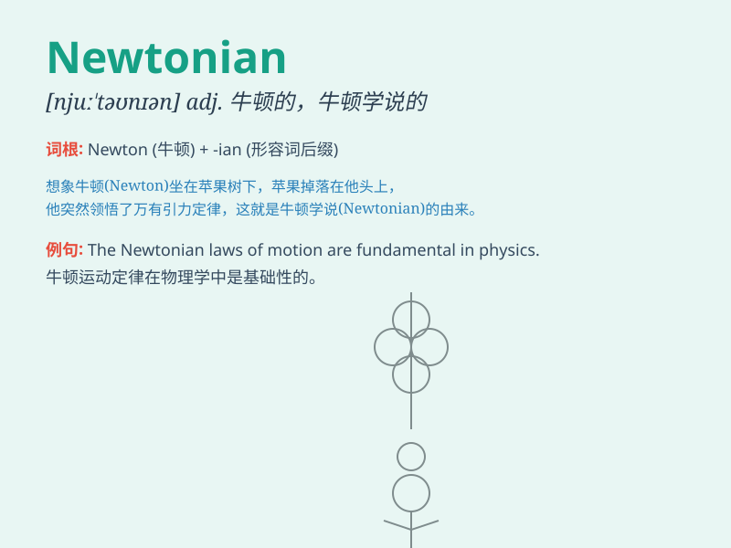

## Newtonian

**英音:** _[njuːˈtəʊniən]_ **美音:** _[nuːˈtoʊniən]_

**译义:** *adj.牛顿（学说）的；牛顿派的；经典力学的*

### 短语

+ **Newtonian mechanics:** _牛顿力学_

+ **Newtonian fluid:** _牛顿流体_

+ **Newtonian theory:** _牛顿理论_

+ **Newtonian gravity:** _牛顿引力_

+ **Newtonian world view:** _牛顿世界观_

### 例句

#### 例句1

> **Newtonian mechanics is widely used in physics education.**

**中文翻译:** 牛顿力学在物理教育中被广泛应用。

**单词释义:** 牛顿的；牛顿学说的

#### 例句2

> **The scientist\'s research was based on Newtonian principles.**

**中文翻译:** 这位科学家的研究基于牛顿原理。

**单词释义:** 牛顿的；牛顿学说的

#### 例句3

> **His thinking was deeply influenced by Newtonian physics.**

**中文翻译:** 他的思维深受牛顿物理学的影响。

**单词释义:** 牛顿的；牛顿学说的

### 背诵小故事

> One day, a young scientist was reading a book about Newton. Suddenly,
he understood the Newtonian laws of physics. He was so excited and
decided to explore more. Now, whenever he sees \'Newtonian\', he
remembers that moment.

**有一天，一位年轻的科学家正在读一本关于牛顿的书。突然，他理解了牛顿的物理学定律。他非常兴奋并决定去探索更多。现在，每当他看到'Newtonian'这个词，他就会想起那一刻。**

### 图义

