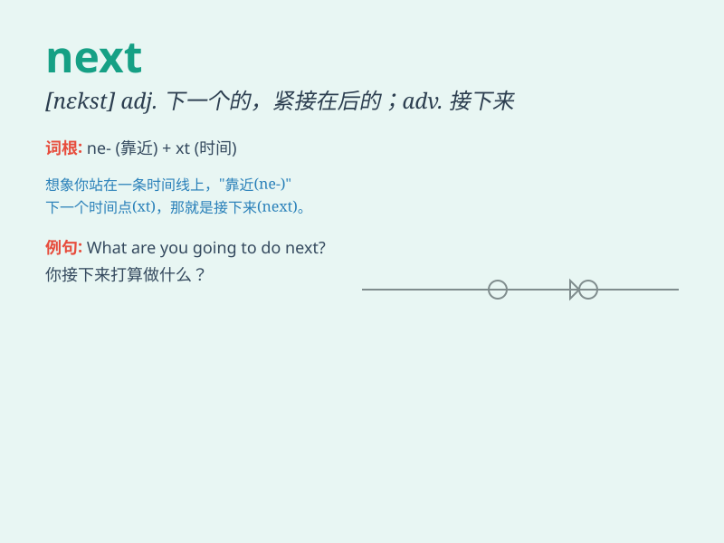

## next

**英音:** _[nekst]_ **美音:** _[nɛkst]_

**译义:** *n.adj.下次的,其次的,与\...连接,下一个adv.下一次,其次*

### 短语

+ **next to:** _紧邻；在......近旁_

+ **next week:** _下周_

+ **next door:** _隔壁；邻家_

+ **next time:** _下次_

+ **the next day:** _第二天_

### 例句

#### 例句1

> **I\'ll see you next week.**

**中文翻译:** 我下周见你。

**单词释义:** 下一个（的）

#### 例句2

> **The next stop is the library.**

**中文翻译:** 下一站是图书馆。

**单词释义:** 下一个（的）

#### 例句3

> **Who\'s next in line?**

**中文翻译:** 谁是下一个排队的？

**单词释义:** 下一个（的）

### 背诵小故事

> One day, I was lost. A kind man pointed and said, \'The exit is next
to the big tree.\' I found it easily. \'Next\' means coming after the
present one.

**有一天，我迷路了。一个好心人指着说：'出口就在那棵大树旁边的下一个。'
我很容易就找到了。'next'意思是紧接在当前之后的。**

### 图义

