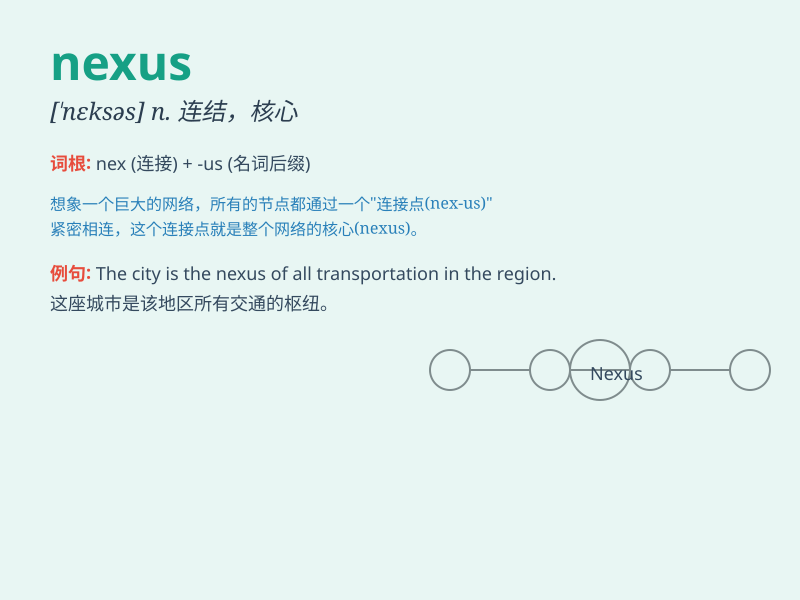

## nexus

**英音:** _[\'neksəs]_ **美音:** _[\'nɛksəs]_

**译义:** *n.连结,关系*

### 短语

+ **trade nexus:** _贸易联系_

+ **nexus of power:** _权力枢纽_

+ **emotional nexus:** _情感纽带_

+ **nexus point:** _连接点_

+ **data nexus:** _数据中心_

### 例句

#### 例句1

> **The nexus between crime and poverty is complex.**

**中文翻译:** 犯罪和贫困之间的联系是复杂的。

**单词释义:** 联系；关系

#### 例句2

> **The city is a nexus of trade and culture.**

**中文翻译:** 这座城市是贸易和文化的枢纽。

**单词释义:** 枢纽；核心

#### 例句3

> **There is a nexus of power and influence in the political
circle.**

**中文翻译:** 在政治圈里存在着权力和影响力的结合。

**单词释义:** 结合；联结

### 背诵小故事

> A brave adventurer was lost in a mysterious forest. After days of
searching, he found a hidden NEXUS, a connection point that led him to
the exit. It was the key to his escape and survival.

**一位勇敢的探险家在神秘森林中迷路了。经过数日的寻找，他发现了一个隐藏的"连接点"nexus，这个连接点引领他找到了出口。它是他逃生和生存的关键。**

### 图义

