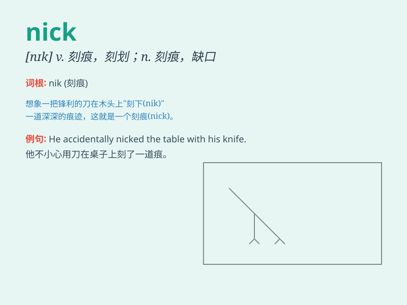

## nick

**英音:** _[nɪk]_ **美音:** _[nɪk]_

**译义:** *n.刻痕,缺口vt.刻痕于,挑毛病vi.阻击*

### 短语

+ **in the nick of time:** _在关键时刻；在最后一刻_

+ **nick name:** _昵称；绰号_

+ **a nick in sth:** _某物上的刻痕、缺口_

+ **nick sth away:** _一点一点地切去（或除去）某物_

+ **nick sb/sth off:** _偷；骗取_

### 例句

#### 例句1

> **The thief had a nick on his hand from the broken window.**

**中文翻译:** 小偷的手被破窗户划了一道口子。

**单词释义:** 口子；刻痕

#### 例句2

> **He managed to nick the ball away from his opponent.**

**中文翻译:** 他设法从对手那里把球抢走了。

**单词释义:** 抢走；夺得

#### 例句3

> **The police nicked him for speeding.**

**中文翻译:** 警察因为他超速把他抓住了。

**单词释义:** 抓住；逮捕

### 背诵小故事

> A thief was running away. The police were chasing him. Just as he
turned a corner, his jacket got a nick on a sharp nail. This nick helped
the police catch him.

**一个小偷正在逃跑。警察在追捕他。就在他转弯时，他的夹克在一个尖锐的钉子上划了一个口子。这个口子帮助警察抓住了他。**

### 图义

