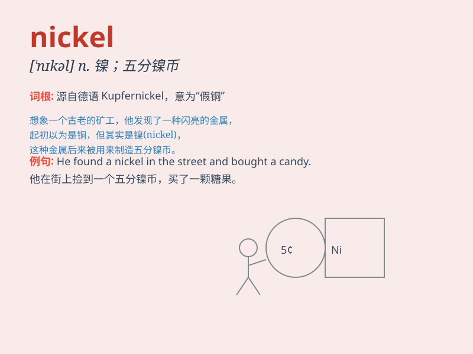

## nickel

**英音:** _[\'nɪk(ə)l]_ **美音:** _[ˈnɪkəl]_

**译义:** *n.[化]镍,镍币,(美国和加拿大的)五分镍币vt.镀镍于*

### 短语

+ **nickel alloy:** _镍合金_

+ **nickel plating:** _镀镍_

+ **nickel coin:** _镍币_

+ **nickel hydroxide:** _氢氧化镍_

+ **nickel steel:** _镍钢_

### 例句

#### 例句1

> **The price of nickel has risen sharply recently.**

**中文翻译:** 镍的价格最近大幅上涨。

**单词释义:** 镍（一种金属元素）

#### 例句2

> **He gave me a nickel as change.**

**中文翻译:** 他给了我一枚五分镍币作为找零。

**单词释义:** 五分镍币

#### 例句3

> **The alloy contains a small amount of nickel.**

**中文翻译:** 这种合金含有少量的镍。

**单词释义:** 镍（一种金属元素）

### 背诵小故事

> A poor boy was always looking for treasures. One day, he found a
shiny object in the dirt. It was a nickel! He was so happy as it could
buy him a small candy.

**一个贫穷的男孩总是在寻找宝藏。有一天，他在泥土里发现了一个闪亮的东西。那是一枚五分镍币！他非常高兴，因为这可以给他买一小块糖果。**

### 图义

