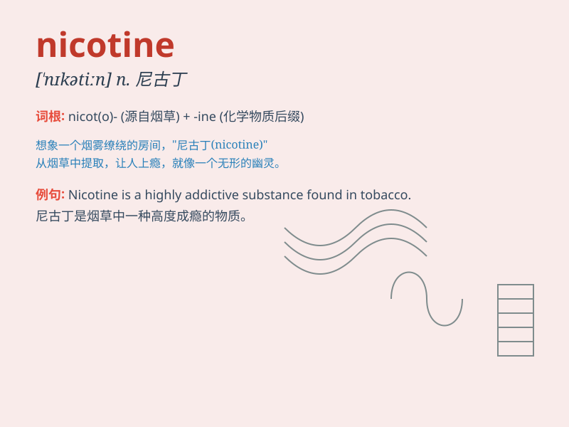

## nicotine

**英音:** _[\'nɪkətiːn]_ **美音:** _[\'nɪkətɪn]_

**译义:** *n.烟碱*

### 短语

+ **nicotine patch:** _尼古丁贴片_

+ **nicotine addiction:** _尼古丁成瘾_

+ **nicotine gum:** _尼古丁口香糖_

+ **nicotine withdrawal:** _尼古丁戒断_

+ **nicotine poisoning:** _尼古丁中毒_

### 例句

#### 例句1

> **Nicotine is highly addictive.**

**中文翻译:** 尼古丁极易上瘾。

**单词释义:** 尼古丁

#### 例句2

> **He tried to quit smoking to reduce his intake of nicotine.**

**中文翻译:** 他试图戒烟以减少尼古丁的摄入量。

**单词释义:** 尼古丁

#### 例句3

> **The patch delivers nicotine gradually to help smokers kick the
habit.**

**中文翻译:** 这种贴片逐渐释放尼古丁以帮助吸烟者戒除烟瘾。

**单词释义:** 尼古丁

### 背诵小故事

> 想象一下，有个调皮的小精灵叫
Nico，他总喜欢在烟草里跳舞，释放出一种让人上瘾的物质，人们就把这种物质叫做
nicotine。后来大家才知道，这就是尼古丁，危害健康。

**想象有个叫 Nico
的小精灵在烟草里释放出被称为尼古丁的让人上瘾且有害健康的物质。**

### 图义

