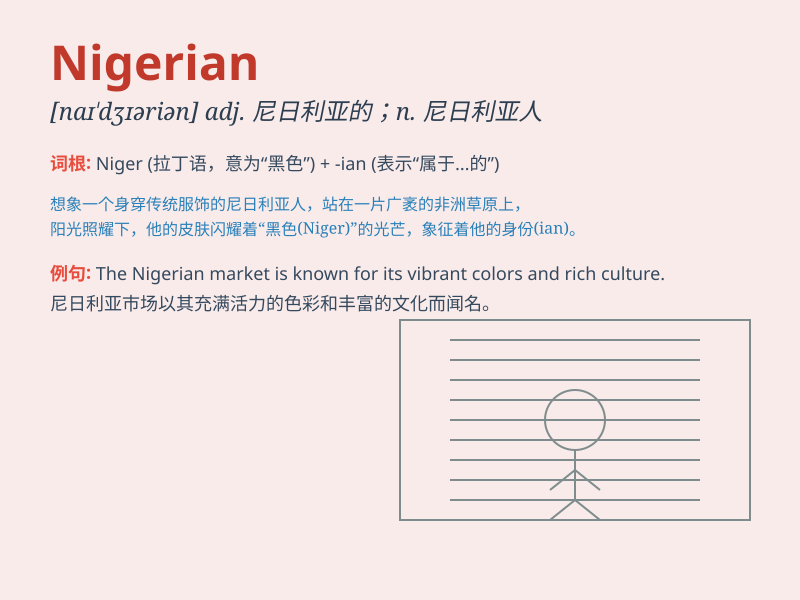

## Nigerian

**英音:** _[naɪˈdʒɪəriən]_ **美音:** _[naɪˈdʒɪriən]_

**译义:** *adj. 尼日利亚的；尼日利亚人的 n. 尼日利亚人*

### 短语

+ **Nigerian student:** _尼日利亚学生_

+ **Nigerian culture:** _尼日利亚文化_

+ **Nigerian cuisine:** _尼日利亚美食_

+ **Nigerian music:** _尼日利亚音乐_

+ **Nigerian fashion:** _尼日利亚时尚_

### 例句

#### 例句1

> **The Nigerian athlete won the gold medal in the race.**

**中文翻译:** 这位尼日利亚运动员在比赛中获得了金牌。

**单词释义:** 尼日利亚的；尼日利亚人的

#### 例句2

> **Nigerian music is becoming increasingly popular worldwide.**

**中文翻译:** 尼日利亚音乐在全球范围内变得越来越受欢迎。

**单词释义:** 尼日利亚的

#### 例句3

> **She has many Nigerian friends.**

**中文翻译:** 她有很多尼日利亚朋友。

**单词释义:** 尼日利亚人的

### 背诵小故事

> A Nigerian artist traveled around the world to showcase his unique
paintings. People were amazed by his talent and the rich culture of
Nigeria he presented.

**一位尼日利亚艺术家环游世界展示他独特的画作。人们对他的才华以及他所展现的尼日利亚丰富文化感到惊叹。**

### 图义

