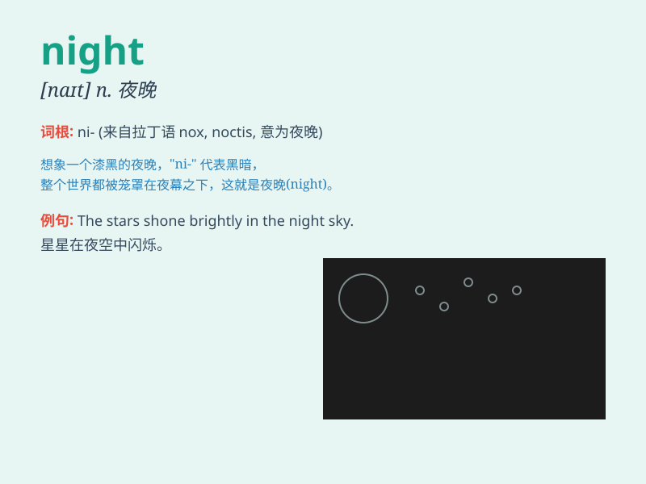

## night

**英音:** _[naɪt]_ **美音:** _[naɪt]_

**译义:** *n.夜,夜晚,黑暗,死亡*

### 短语

+ **night owl:** _习惯晚睡的人_

+ **night shift:** _夜班_

+ **nightmare:** _噩梦_

+ **good night:** _晚安_

+ **night and day:** _夜以继日_

### 例句

#### 例句1

> **I often read books at night.**

**中文翻译:** 我经常在晚上读书。

**单词释义:** 晚上；夜晚

#### 例句2

> **The city looks beautiful at night with all the lights on.**

**中文翻译:** 这座城市在夜晚所有灯光亮起时看起来很美。

**单词释义:** 夜晚；夜间

#### 例句3

> **She had a bad dream last night.**

**中文翻译:** 她昨晚做了个噩梦。

**单词释义:** 昨晚

### 背诵小故事

> One night, a little boy was afraid of the dark. But when he saw the
beautiful stars and the soft moonlight, he wasn\'t scared anymore. Night
can be both mysterious and peaceful.

**一天晚上，一个小男孩害怕黑暗。但当他看到美丽的星星和柔和的月光时，他不再害怕了。夜晚既神秘又宁静。**

### 图义

