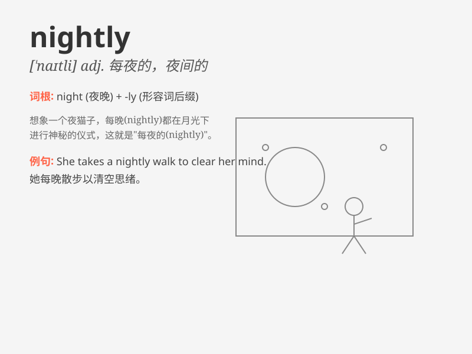

## nightly

**英音:** _[\'naɪtlɪ]_ **美音:** _[\'naɪtli]_

**译义:** *adj.每夜的adv.夜夜*

### 短语

+ **nightly routine:** _每晚的例行活动或程序_

+ **nightly news:** _晚间新闻节目_

+ **nightly patrol:** _夜间巡逻_

+ **nightly occurrence:** _每晚发生的事件或现象_

+ **nightly ritual:** _每晚进行的仪式或习惯_

### 例句

#### 例句1

> **The news program airs nightly at 7 PM.**

**中文翻译:** 这个新闻节目每晚 7 点播出。

**单词释义:** 每晚；每夜

#### 例句2

> **She takes a nightly walk to relax.**

**中文翻译:** 她每晚散步来放松。

**单词释义:** 每晚；每夜

#### 例句3

> **The hotel offers a nightly turndown service.**

**中文翻译:** 这家酒店提供每晚的开床服务。

**单词释义:** 每晚；每夜

### 背诵小故事

> One night, a little star was shining nightly. It worked hard every
night to light up the sky. People looked up and felt peaceful. From then
on, they remembered the word \'nightly\' as something that happens every
night.

**一天晚上，一颗小星星每晚都在闪耀。它每晚都努力工作照亮天空。人们抬头看，感到平静。从那以后，他们记住了'nightly'这个词，表示每晚发生的事情。**

### 图义

