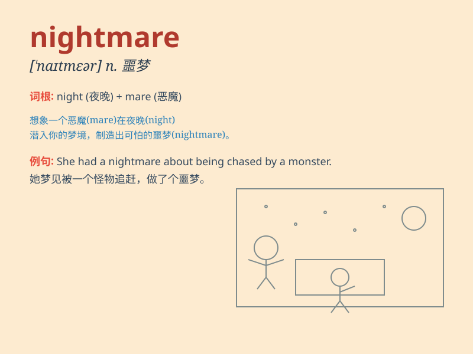

## nightmare

**英音:** _[\'naɪtmeə]_ **美音:** _[\'naɪt\'mɛr]_

**译义:** *n.梦魇,恶梦,可怕的事物*

### 短语

+ **nightmare scenario:** _最糟糕的情况或设想_

+ **live through a nightmare:** _经历一场噩梦般的经历_

+ **nightmare on Elm Street:**
_一部著名的恐怖电影系列，讲述了一个恶梦中的杀手_

+ **nightmare fuel:** _指那些令人极度不安或恐惧的图像或内容_

+ **nightmare before Christmas:**
_一部著名的动画电影，讲述了一个万圣节小镇的居民准备圣诞节的故事_

### 例句

#### 例句1

> **I had a terrifying nightmare last night.**

**中文翻译:** 我昨晚做了一个可怕的噩梦。

**单词释义:** 噩梦

#### 例句2

> **The war was a nightmare for the civilians.**

**中文翻译:** 这场战争对平民来说是一场噩梦。

**单词释义:** 可怕的经历；噩梦般的事情

#### 例句3

> **Moving house proved to be a nightmare.**

**中文翻译:** 搬家结果成了一场噩梦。

**单词释义:** 令人痛苦的事情；噩梦

### 背诵小故事

> One night, I had a terrifying dream. I was lost in a dark forest and
chased by monsters. When I woke up, sweating and scared, I realized it
was a nightmare. A nightmare is a very bad and scary dream that makes
you feel frightened.

**有一天晚上，我做了一个可怕的梦。我在黑暗的森林里迷路了，还被怪物追赶。当我醒来时，浑身是汗，非常害怕，我意识到这是一场噩梦。噩梦就是那种非常糟糕且吓人、让你感到恐惧的梦。**

### 图义

