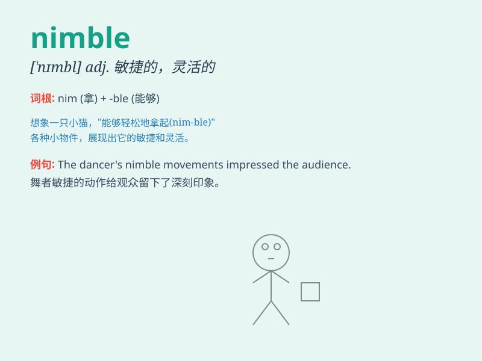

## nimble

**英音:** _[\'nɪmb(ə)l]_ **美音:** _[\'nɪmbl]_

**译义:** *adj.敏捷的*

### 短语

+ **nimble fingers:** _灵巧的手指_

+ **nimble mind:** _敏捷的思维_

+ **nimble-footed:** _脚步轻快的_

+ **nimble movement:** _灵活的动作_

+ **nimble wit:** _机智灵敏_

### 例句

#### 例句1

> **The nimble monkey climbed up the tree quickly.**

**中文翻译:** 这只敏捷的猴子很快爬上了树。

**单词释义:** 敏捷的

#### 例句2

> **She has nimble fingers and can knit very well.**

**中文翻译:** 她手指灵活，能织得很好。

**单词释义:** 灵活的

#### 例句3

> **The dancer\'s movements were nimble and graceful.**

**中文翻译:** 舞者的动作敏捷而优美。

**单词释义:** 敏捷的

### 背诵小故事

> A monkey was trying to catch a bird. The monkey was very nimble. It
jumped from branch to branch quickly and finally got close to the bird.
It shows that nimble means being quick and agile.

**一只猴子试图抓住一只鸟。这只猴子非常灵活。它快速地从一个树枝跳到另一个树枝，最后接近了鸟。这表明
nimble 意味着敏捷、灵活。**

### 图义

