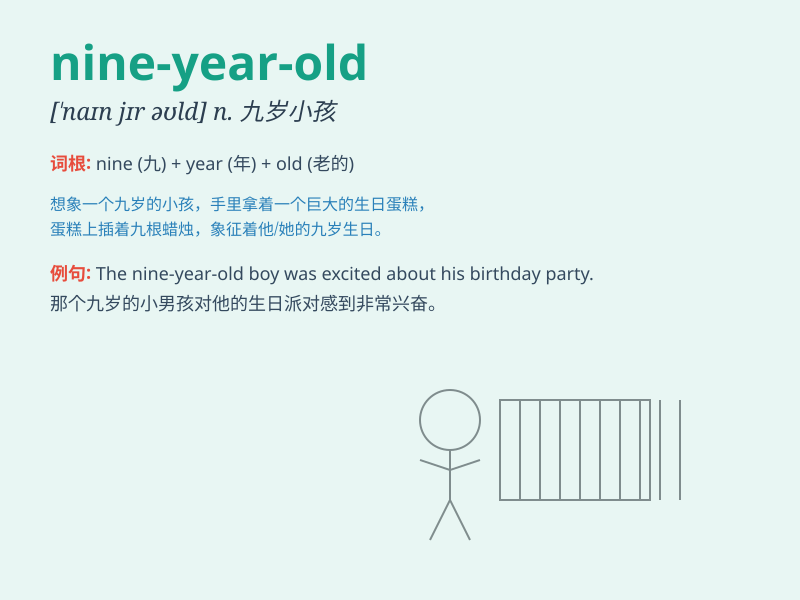

## nine-year-old

**英音:** _[naɪn jɪər əʊld]_ **美音:** _[naɪn jɪr oʊld]_

**译义:** *adj. 九岁的；n. 九岁的人*

### 短语

+ **a nine-year-old boy:** _一个九岁的男孩_

+ **a nine-year-old girl:** _一个九岁的女孩_

+ **nine-year-old children:** _九岁的孩子们_

+ **the nine-year-old:** _这个九岁的（人）_

+ **nine-year-old students:** _九岁的学生们_

### 例句

#### 例句1

> **The nine-year-old boy is very smart.**

**中文翻译:** 这个九岁的男孩非常聪明。

**单词释义:** 九岁的（用来形容男孩的年龄）

#### 例句2

> **She has a nine-year-old daughter.**

**中文翻译:** 她有一个九岁的女儿。

**单词释义:** 九岁的（用来形容女儿的年龄）

#### 例句3

> **The nine-year-old girl loves reading books.**

**中文翻译:** 这个九岁的女孩喜欢读书。

**单词释义:** 九岁的（用来形容女孩的年龄）

### 背诵小故事

> There was a nine-year-old boy named Tom. He loved to play football
and was always full of energy. One day, he scored the winning goal in a
game, making everyone proud. Remember, \'nine-year-old\' describes
someone who is nine years old, like Tom.

**有一个名叫汤姆的九岁男孩。他喜欢踢足球，总是充满活力。有一天，他在一场比赛中踢进了制胜球，让所有人都感到骄傲。记住，\'nine-year-old\'
描述的是九岁的人，就像汤姆。**

### 图义

