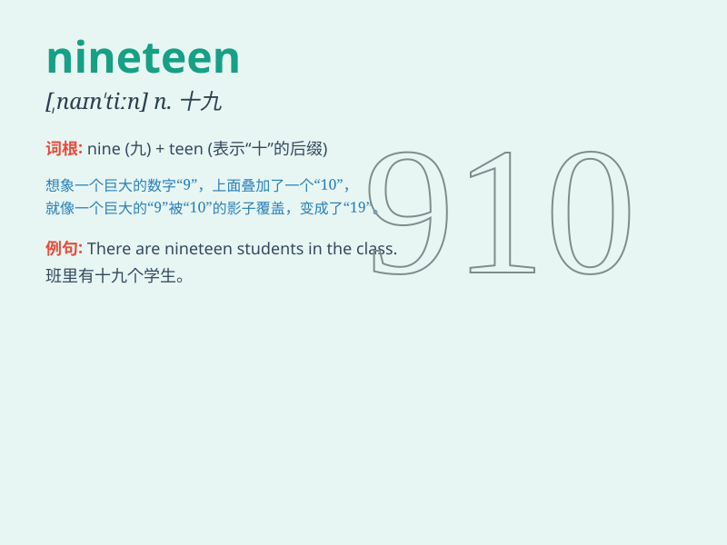

## nineteen

**英音:** _[naɪn\'tiːn; \'naɪntiːn]_ **美音:**
_[,naɪn\'tin]_

**译义:** * num.十九*

### 短语

+ **nineteen years old:** _十九岁_

+ **nineteen people:** _十九个人_

+ **group of nineteen:** _十九人的小组_

+ **nineteen dollars:** _十九美元_

+ **nineteen minutes:** _十九分钟_

### 例句

#### 例句1

> **I am nineteen years old.**

**中文翻译:** 我十九岁了。

**单词释义:** 十九

#### 例句2

> **There are nineteen students in the classroom.**

**中文翻译:** 教室里有十九个学生。

**单词释义:** 十九

#### 例句3

> **She bought nineteen apples from the market.**

**中文翻译:** 她从市场买了十九个苹果。

**单词释义:** 十九

### 背诵小故事

> One day, a little monkey wanted to collect nineteen bananas. It
climbed trees and searched everywhere. Finally, it got all nineteen and
was very happy. The number nineteen became a special memory for the
monkey.

**有一天，一只小猴子想要收集十九根香蕉。它爬上树到处寻找。最后，它得到了全部的十九根香蕉，非常开心。数字十九成了猴子的特别记忆。**

### 图义

