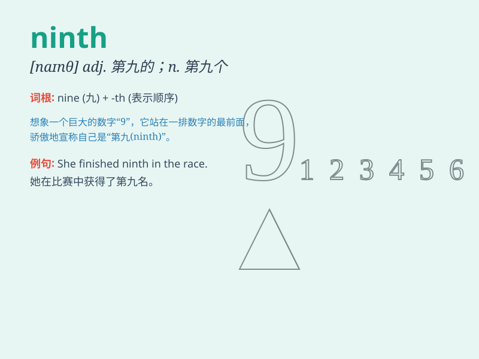

## ninth

**英音:** _[\'naɪnθ]_ **美音:** _[naɪnθ]_

**译义:** * num.第九,九分之一*

### 短语

+ **ninth grade:** _九年级_

+ **the ninth day:** _第九天_

+ **ninth inning:** _第九局_

+ **ninth place:** _第九名_

+ **ninth month:** _第九个月_

### 例句

#### 例句1

> **He came ninth in the race.**

**中文翻译:** 他在赛跑中得了第九名。

**单词释义:** 第九

#### 例句2

> **This is my ninth attempt to solve the problem.**

**中文翻译:** 这是我解决这个问题的第九次尝试。

**单词释义:** 第九

#### 例句3

> **The ninth chapter of the book is very interesting.**

**中文翻译:** 这本书的第九章非常有趣。

**单词释义:** 第九

### 背诵小故事

> The little prince was very excited because it was his ninth birthday.
He got nine colorful balloons and nine pieces of delicious cake.
Everyone sang the song \'Happy Ninth Birthday\' to him.

**小王子非常兴奋，因为这是他的九岁生日。他得到了九个彩色气球和九块美味的蛋糕。每个人都为他唱了'第九个生日快乐'这首歌。**

### 图义

