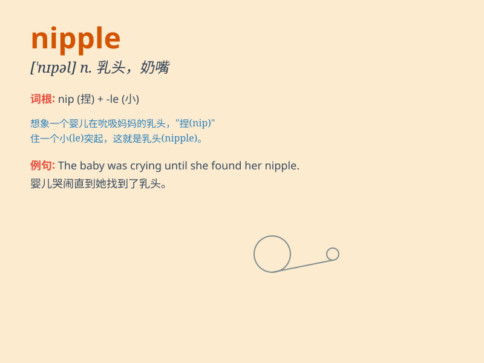

## nipple

**英音:** _[\'nɪp(ə)l]_ **美音:** _[\'nɪpl]_

**译义:** *n.乳头,奶嘴*

### 短语

+ **nipple shield:** _乳头罩_

+ **nipple cream:** _乳头霜_

+ **nipple discharge:** _乳头溢液_

+ **nipple piercing:** _乳头穿孔_

+ **nipple clamp:** _乳头夹_

### 例句

#### 例句1

> **The baby was sucking on the nipple of the bottle.**

**中文翻译:** 婴儿正在吮吸奶瓶的奶嘴。

**单词释义:** 奶嘴

#### 例句2

> **The nipple of the gas cylinder was damaged.**

**中文翻译:** 这个煤气罐的气嘴损坏了。

**单词释义:** 气嘴

#### 例句3

> **The nipple of the watering can was clogged.**

**中文翻译:** 喷壶的喷头被堵住了。

**单词释义:** 喷头

### 背诵小故事

>
想象一下，小宝宝饿哭了，妈妈赶紧抱起宝宝，让宝宝含住乳头（nipple）开始吃奶，宝宝马上就安静满足了。nipple
就是指乳头、奶嘴等突出的部分。

**想象小宝宝吃奶的场景来记住'nipple'表示乳头、奶嘴等突出的部分**

### 图义

