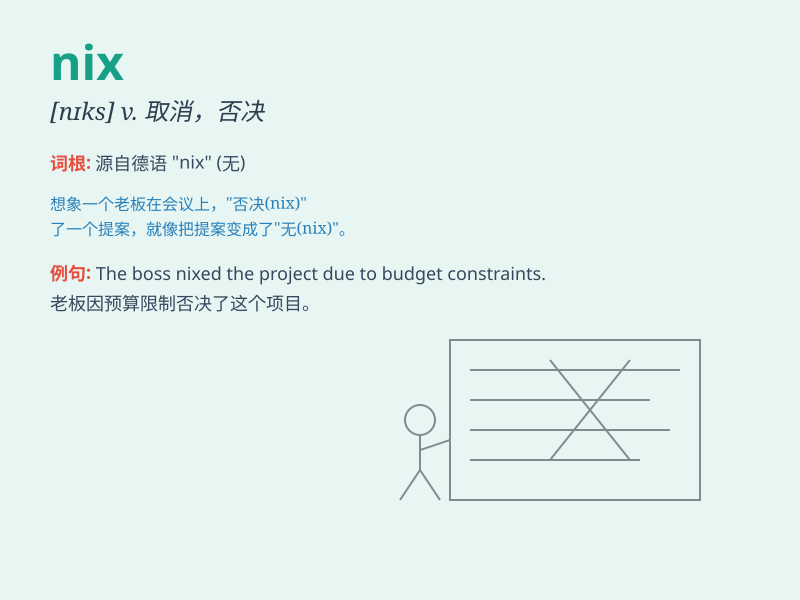

## nix

**英音:** _[nɪks]_ **美音:** _[nɪks]_

**译义:**
*n.\<俚>无,皆无,(德国神话中的)女水妖,女水神int.停!,不要!,不行!vt.禁止,拒绝*

### 短语

+ **nix on:** _反对；拒绝_

+ **come to nix:** _失败；毫无结果_

+ **be nix:** _不行；没门_

+ **nix out:** _取消；废除_

+ **give nix:** _拒绝；否定_

### 例句

#### 例句1

> **The plan was nixed by the boss.**

**中文翻译:** 这个计划被老板否决了。

**单词释义:** 否决；拒绝

#### 例句2

> **They nixed the idea of going on vacation this year.**

**中文翻译:** 他们打消了今年去度假的念头。

**单词释义:** 打消；放弃

#### 例句3

> **The proposal was nixed due to lack of funds.**

**中文翻译:** 由于资金缺乏，这个提议被否定了。

**单词释义:** 否定；禁止

### 背诵小故事

> One day, Tom was in a hurry to go to a party. But when he saw the bad
weather, he decided to nix the plan. Just like that, he stayed at home.
Nix here means to cancel or reject something.

**一天，汤姆着急去参加一个聚会。但当他看到糟糕的天气时，他决定取消这个计划。就这样，他待在了家里。这里的
nix 意思是取消或拒绝某事。**

### 图义

