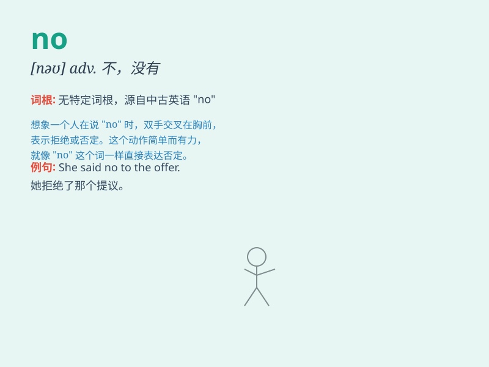

## no

**英音:** _[nəʊ]_ **美音:** _[no]_

**译义:** *n.否定,投反对票者adj.没有,不许,反对adv.不,并不,毫不
[域] Norway ,挪威*

### 短语

+ **no problem:** _没问题_

+ **no wonder:** _难怪_

+ **no longer:** _不再_

+ **no more:** _不再；也不_

+ **say no:** _拒绝；说不_

### 例句

#### 例句1

> **No, I don\'t like coffee.**

**中文翻译:** 不，我不喜欢咖啡。

**单词释义:** 表示否定

#### 例句2

> **There is no water in the bottle.**

**中文翻译:** 瓶子里没有水。

**单词释义:** 没有

#### 例句3

> **No smoking here.**

**中文翻译:** 这里禁止吸烟。

**单词释义:** 禁止

### 背诵小故事

> A little boy wants to eat ice cream. But his mom says no because
it\'s too cold. The boy is sad. But he understands that no sometimes
means not allowed or not possible.

**一个小男孩想吃冰淇淋。但是他妈妈说不，因为天气太冷了。小男孩很伤心。但他明白'no'有时意味着不允许或者不可能。**

### 图义

