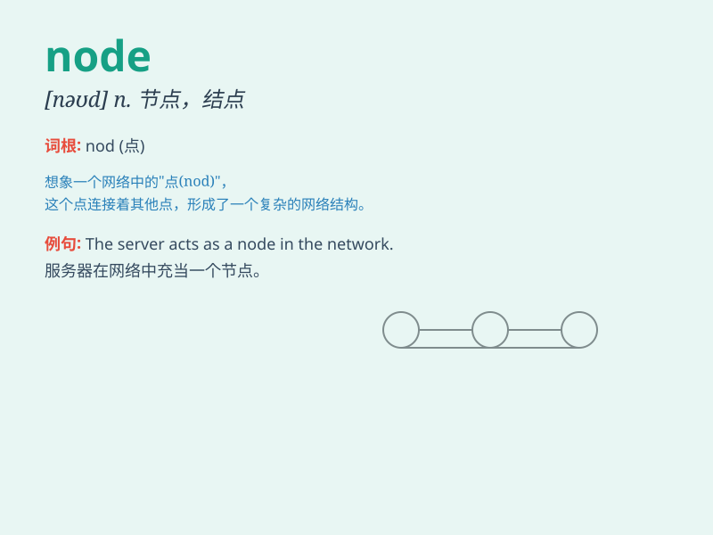

## node

**英音:** _[nəʊd]_ **美音:** _[nod]_

**译义:** *n.节点*

### 短语

+ **communication node:** _通信节点_

+ **network node:** _网络节点_

+ **sensory node:** _感觉节点_

+ **distribution node:** _分布节点_

+ **data node:** _数据节点_

### 例句

#### 例句1

> **The node in the network was malfunctioning.**

**中文翻译:** 网络中的节点出现了故障。

**单词释义:** 节点

#### 例句2

> **The lymph nodes in his neck were swollen.**

**中文翻译:** 他脖子上的淋巴结肿了。

**单词释义:** 淋巴结

#### 例句3

> **Each node of the graph represents a specific data point.**

**中文翻译:** 图表的每个节点代表一个特定的数据点。

**单词释义:** 节点

### 背诵小故事

> Imagine a huge computer network as a tree. Each point where data
connects and branches out is a node. Just like a knot in a rope that
holds things together, a node in the network keeps data flowing
smoothly.

**想象一个巨大的计算机网络像一棵树。每个数据连接和分支的点就是一个节点。就像绳子上把东西系在一起的结，网络中的节点能让数据流畅地流动。**

### 图义

