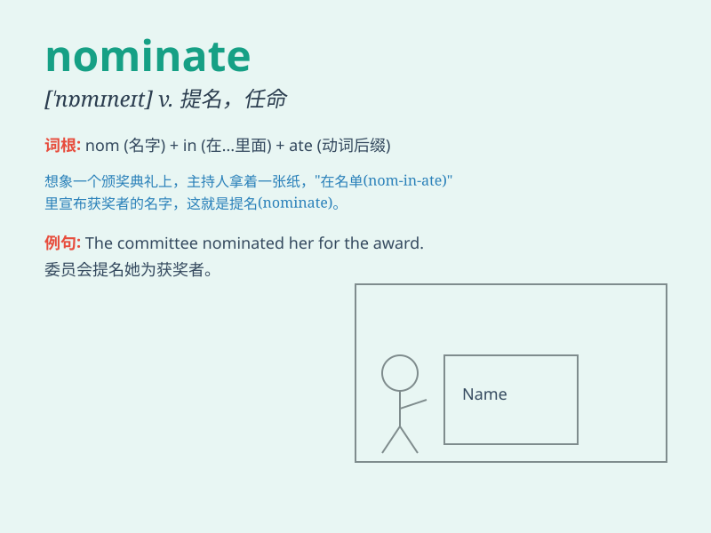

## nominate

**英音:** _[\'nɒmɪneɪt]_ **美音:** _[\'nɑmɪnet]_

**译义:** *vt.提名,推荐,任命,命名*

### 短语

+ **nominate sb for sth:** _提名某人担任某职位或获得某奖项_

+ **nominate sb as sth:** _任命某人担任某职务_

+ **be nominated to do sth:** _被提名做某事_

+ **nominate oneself:** _自我推荐_

+ **nominate candidates:** _提名候选人_

### 例句

#### 例句1

> **The president has the power to nominate judges to the Supreme
Court.**

**中文翻译:** 总统有权向最高法院提名法官。

**单词释义:** 提名；推荐

#### 例句2

> **She was nominated for an Academy Award for her performance in the
film.**

**中文翻译:** 她因在这部电影中的表演获得了奥斯卡奖提名。

**单词释义:** 提名

#### 例句3

> **The committee will nominate a new chairperson next month.**

**中文翻译:** 委员会下个月将提名一位新主席。

**单词释义:** 提名；任命

### 背诵小故事

> A king needed to nominate a brave knight for an important mission. He
chose the one who showed the most courage in battle. \'Nominate\' means
to officially choose or propose someone for a position or task.

**一位国王需要为一项重要任务提名一位勇敢的骑士。他选择了在战斗中表现出最大勇气的那位。"nominate"意思是正式选定或推荐某人担任某职位或承担某任务。**

### 图义

