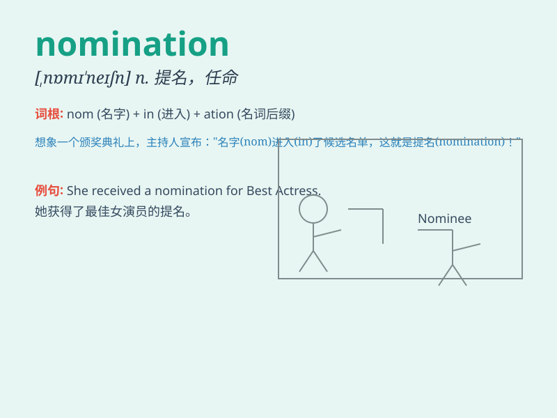

## nomination

**英音:** _[nɒmɪ\'neɪʃ(ə)n]_ **美音:** _[,nɑmɪ\'neʃən]_

**译义:** *n.任命*

### 短语

+ **nomination process:** _提名过程_

+ **nomination form:** _提名表格_

+ **nomination committee:** _提名委员会_

+ **receive a nomination:** _获得提名_

+ **put forward a nomination:** _提出提名_

### 例句

#### 例句1

> **His nomination for the award was well-deserved.**

**中文翻译:** 他获得该奖项的提名是当之无愧的。

**单词释义:** 提名

#### 例句2

> **The nomination process for the position is very competitive.**

**中文翻译:** 这个职位的提名过程竞争非常激烈。

**单词释义:** 提名（过程）

#### 例句3

> **She received a nomination for her outstanding performance in the
play.**

**中文翻译:** 她因在剧中的出色表现而获得提名。

**单词释义:** 提名

### 背诵小故事

> A young actor was extremely excited when he received a nomination for
the best performance. He had worked hard for years, and this nomination
was like a bright light in his career path.

**一位年轻演员在获得最佳表演的提名时兴奋极了。他多年来一直努力工作，这次提名就像他职业道路上的一道亮光。**

### 图义

